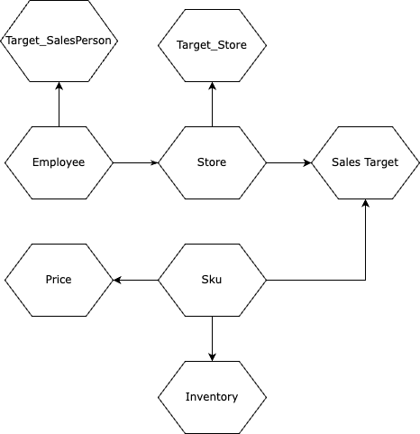
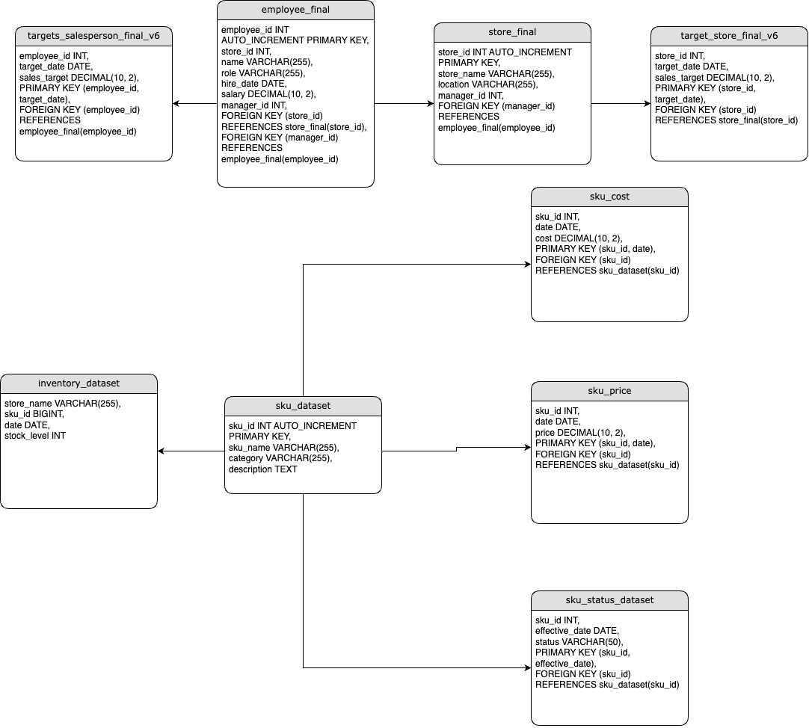
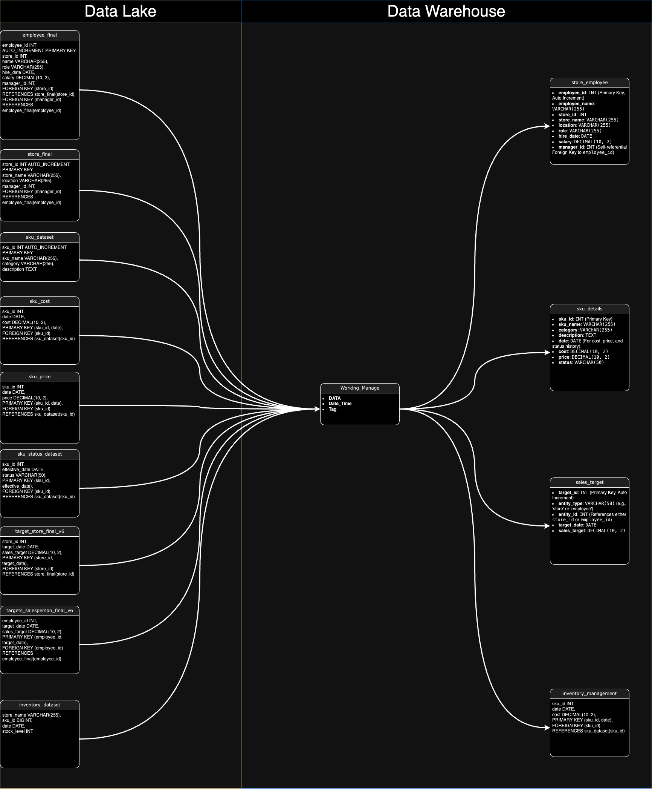

# Documentação do Projeto BCGeniuns

## Sumário
1. [Modelagem](#Arquitetura-de-Dados-e-Informação)
   -  [Modelo Conceitual de Dados](#Modelo-Conceitual-de-Dados)
   -  [Modelo Lógico de Dados](#Modelo-Lógico-de-Dados)
   -  [Modelo Relacional](#Modelo-Relacional)
   -  [Modelo Físico](#Modelo-Fisico)
2. [Segurança e Governança](#Segurança-e-Governança)
   - [Considerações Estratégicas](#Considerações-estratégicas)
   - [Planos de Ação](#Planos-de-ação)
3. [Acesso, LGPD e Governança de Dados](#Acesso,-LGPD-e-Governança-de-Dados)
   - [Acesso](#Acesso)
   - [LGPD](#LGPD)
   - [Governança de Dados](#Governança-de-Dados)
   - [Impacto na eficiência operacional](#4.Impacto-na-eficiência-operacional)
   - [Contribuição para a cultura da privacidade](#5.-Contribuição-para-a-cultura-da-privacidade)
4. [Plano de Monitoramento e Gerenciamento](#Plano-de-Monitoramento-e-Gerenciamento-na-Arquitetura)
5. [Integração de Aspectos Não Técnicos](#Integração-de-Aspectos-Não-Técnicos)
6. [Analise do wireframe](#Análise-do-Wireframe)
   - [Relações do wireframe com a Análise Exploratória](#Relações-do-wireframe-com-a-Análise-Exploratória)
   - [Relações do wireframe com a arquitetura existente](#Relações-do-wireframe-com-a-arquitetura-existente)
   - [Plano de Tarefas](#Plano-de-Tarefas)
   - [Cumprimento do plano de tarefas](Cumprimento-do-plano-de-tarefas)
   - [Relevância dos Gráficos para o Acompanhamento de Dados](#Relevância-dos-Gráficos-para-o-Acompanhamento-de-Dados)
   - [Relações com os testes e apontamentos de usabilidade ](#Relações-com-os-testes-e-apontamentos-de-usabilidade)
7. [Documentação incremental](#Abordagem-Incremental)
   - [Abordagem Incremental](#Abordagem-Incremental)
   - [Governança de Dados](#Governança-de-Dados)
   - [Relevância para a Tomada de Decisões](#Relevância-para-a-Tomada-de-Decisões)
   - [Qualidade da Documentação](#Qualidade-da-Documentação)


## Arquitetura de Dados e Informação

## Modelo Conceitual de Dados



O **Modelo Conceitual de Dados** é uma representação de alto nível que define as principais entidades envolvidas no sistema e suas relações. Este modelo serve para estabelecer a estrutura básica dos dados, focando em como as entidades se relacionam entre si sem entrar em detalhes técnicos ou estruturais.

#### **Entidades Principais:**
- **Employee**: Representa os funcionários, com atributos que incluem informações pessoais e relacionamentos dentro da organização.
- **Store**: Refere-se às lojas, vinculadas aos funcionários que as gerenciam.
- **SKU**: Refere-se aos produtos (Stock Keeping Unit), sendo o núcleo das operações de inventário e vendas.
- **Sales Target**: Relaciona-se às metas de vendas que são estabelecidas para lojas e funcionários.
- **Price**: Entidade associada aos produtos, armazenando informações sobre preços ao longo do tempo.
- **Inventory**: Gestão de inventário, rastreando o nível de estoque dos produtos em cada loja.

#### **Relacionamentos:**
- **Employee-Store**: Um funcionário pode gerenciar uma ou várias lojas.
- **Store-Sales Target**: Cada loja tem metas de vendas específicas.
- **SKU-Price**: Cada produto possui um histórico de preços.
- **SKU-Inventory**: O inventário está associado a cada produto em cada loja.
- **Target SalesPerson** e **Target Store**: As metas de vendas são relacionadas tanto com os funcionários quanto com as lojas.

Este modelo conceitual é a base sobre a qual os modelos mais detalhados, como o lógico e o físico, são construídos.

## Modelo Lógico de Dados



O **Modelo Lógico de Dados** traduz o modelo conceitual para um nível mais detalhado, estabelecendo as tabelas e os campos necessários para implementar o sistema de banco de dados, mas ainda sem considerar as peculiaridades do SGBD específico. Este modelo serve para detalhar as estruturas de dados que serão usadas no sistema, preparando o terreno para a implementação física.

#### **Tabelas Principais:**
- **employee_final**: Contém informações sobre os funcionários, incluindo o ID, nome, cargo, data de contratação e vínculo com a loja que gerenciam.
- **store_final**: Armazena detalhes das lojas, como nome, localização e gerente responsável.
- **sku_dataset**: Guarda informações dos produtos, incluindo nomes, categorias e descrições.
- **sku_cost** e **sku_price**: Mantêm o histórico de custos e preços dos produtos ao longo do tempo.
- **inventory_dataset**: Gerencia o nível de estoque dos produtos em cada loja.
- **sales_target**: Armazena as metas de vendas associadas a cada loja e produto.
- **target_store_final_v6** e **target_salesperson_final_v6**: Guardam as metas de vendas para lojas e funcionários, respectivamente.

#### **Relacionamentos:**
- **Chaves Primárias e Estrangeiras**: Definem as ligações entre as tabelas, garantindo a integridade referencial. Por exemplo, `store_final` está ligada a `employee_final` através de `manager_id`, e `sku_dataset` está associada a `sku_cost`, `sku_price`, e `inventory_dataset` através de `sku_id`.

O modelo lógico prepara o caminho para a implementação física, detalhando as relações entre as tabelas e garantindo que todos os aspectos do modelo conceitual sejam representados.


## Modelo Relacional



O **Esquema de Dados (Modelo Relacional)** é a implementação física do modelo lógico em um Sistema de Gerenciamento de Banco de Dados (SGBD). Este modelo define a estrutura exata das tabelas, os tipos de dados, as chaves primárias e estrangeiras, bem como as restrições e índices necessários para otimizar o desempenho.

#### **Definição de Tabelas e Campos:**
- **employee_final**: Contém colunas como `employee_id`, `store_id`, `name`, `role`, `hire_date`, `salary`, e `manager_id`, com chaves estrangeiras estabelecendo relações com `store_final` e consigo mesma.
- **store_final**: Inclui colunas como `store_id`, `store_name`, `location`, `opening_date`, e `manager_id`, com relações de chave estrangeira ligando-a a `employee_final`.
- **sku_dataset**: Define os produtos com campos como `sku_id`, `sku_name`, `category`, e `description`.
- **sku_cost** e **sku_price**: Estas tabelas mantêm registros de custos e preços, respectivamente, vinculados a `sku_dataset` através de chaves estrangeiras.
- **inventory_dataset**: Gerencia o nível de estoque de cada produto, associado a `sku_dataset`.
- **sales_target**: Armazena as metas de vendas por loja e produto, vinculadas a `store_final` e `sku_dataset`.

## Modelo Fisico

O Modelo Físico de Dados é a implementação detalhada do modelo lógico em um Sistema de Gerenciamento de Banco de Dados (SGBD) específico.

#### 1. **Tabela `employee_final`**
```sql
CREATE TABLE employee_final (
    employee_id INT AUTO_INCREMENT PRIMARY KEY,
    store_id INT,
    name VARCHAR(255) NOT NULL,
    role VARCHAR(255),
    hire_date DATE,
    salary DECIMAL(10, 2),
    manager_id INT,
    FOREIGN KEY (store_id) REFERENCES store_final(store_id),
    FOREIGN KEY (manager_id) REFERENCES employee_final(employee_id)
);
```

#### 2. **Tabela `store_final`**
```sql
CREATE TABLE store_final (
    store_id INT AUTO_INCREMENT PRIMARY KEY,
    store_name VARCHAR(255) NOT NULL,
    location VARCHAR(255),
    opening_date DATE,
    manager_id INT,
    FOREIGN KEY (manager_id) REFERENCES employee_final(employee_id)
);
```

#### 3. **Tabela `sku_dataset`**
```sql
CREATE TABLE sku_dataset (
    sku_id INT AUTO_INCREMENT PRIMARY KEY,
    sku_name VARCHAR(255) NOT NULL,
    category VARCHAR(255),
    description TEXT
);
```

#### 4. **Tabela `sku_cost`**
```sql
CREATE TABLE sku_cost (
    sku_id INT,
    date DATE,
    cost DECIMAL(10, 2) NOT NULL,
    PRIMARY KEY (sku_id, date),
    FOREIGN KEY (sku_id) REFERENCES sku_dataset(sku_id)
);
```

#### 5. **Tabela `sku_price`**
```sql
CREATE TABLE sku_price (
    sku_id INT,
    date DATE,
    price DECIMAL(10, 2) NOT NULL,
    PRIMARY KEY (sku_id, date),
    FOREIGN KEY (sku_id) REFERENCES sku_dataset(sku_id)
);
```

#### 6. **Tabela `sku_status_dataset`**
```sql
CREATE TABLE sku_status_dataset (
    sku_id INT,
    effective_date DATE,
    status VARCHAR(50),
    PRIMARY KEY (sku_id, effective_date),
    FOREIGN KEY (sku_id) REFERENCES sku_dataset(sku_id)
);
```

#### 7. **Tabela `target_store_final_v6`**
```sql
CREATE TABLE target_store_final_v6 (
    store_id INT,
    target_date DATE,
    sales_target DECIMAL(10, 2),
    PRIMARY KEY (store_id, target_date),
    FOREIGN KEY (store_id) REFERENCES store_final(store_id)
);
```

#### 8. **Tabela `target_salesperson_final_v6`**
```sql
CREATE TABLE target_salesperson_final_v6 (
    employee_id INT,
    target_date DATE,
    sales_target DECIMAL(10, 2),
    PRIMARY KEY (employee_id, target_date),
    FOREIGN KEY (employee_id) REFERENCES employee_final(employee_id)
);
```

#### 9. **Tabela `inventory_dataset`**
```sql
CREATE TABLE inventory_dataset (
    store_name VARCHAR(255),
    sku_id BIGINT,
    date DATE,
    stock_level INT,
    PRIMARY KEY (sku_id, date),
    FOREIGN KEY (sku_id) REFERENCES sku_dataset(sku_id)
);
```

#### 10. **Tabela `store_employee`**
```sql
CREATE TABLE store_employee (
    employee_id INT PRIMARY KEY,
    store_id INT,
    name VARCHAR(255) NOT NULL,
    hire_date DATE,
    manager_id INT,
    FOREIGN KEY (store_id) REFERENCES store_final(store_id),
    FOREIGN KEY (manager_id) REFERENCES employee_final(employee_id)
);
```

#### 11. **Tabela `sku_details`**
```sql
CREATE TABLE sku_details (
    sku_id INT PRIMARY KEY,
    sku_name VARCHAR(255) NOT NULL,
    category VARCHAR(100),
    cost DECIMAL(10, 2),
    price DECIMAL(10, 2),
    status VARCHAR(100)
);
```

#### 12. **Tabela `sales_target`**
```sql
CREATE TABLE sales_target (
    target_id INT AUTO_INCREMENT PRIMARY KEY,
    store_id INT,
    sku_id INT,
    sales_target DECIMAL(10, 2) NOT NULL,
    target_date DATE NOT NULL,
    FOREIGN KEY (store_id) REFERENCES store_final(store_id),
    FOREIGN KEY (sku_id) REFERENCES sku_dataset(sku_id)
);
```

#### **Explicação das Tabelas do modelo fisico:**

1. **employee_final**:
   - **Colunas**:
     - `employee_id` (INT, AUTO_INCREMENT, PRIMARY KEY)
     - `store_id` (INT, FOREIGN KEY referenciando `store_final(store_id)`)
     - `name` (VARCHAR(255), NOT NULL)
     - `role` (VARCHAR(255))
     - `hire_date` (DATE)
     - `salary` (DECIMAL(10, 2))
     - `manager_id` (INT, FOREIGN KEY referenciando `employee_final(employee_id)`)
   - **Descrição**: Esta tabela armazena dados detalhados sobre os funcionários, incluindo informações pessoais, cargo, salário, e as relações hierárquicas entre os funcionários.

2. **store_final**:
   - **Colunas**:
     - `store_id` (INT, AUTO_INCREMENT, PRIMARY KEY)
     - `store_name` (VARCHAR(255), NOT NULL)
     - `location` (VARCHAR(255))
     - `opening_date` (DATE)
     - `manager_id` (INT, FOREIGN KEY referenciando `employee_final(employee_id)`)
   - **Descrição**: Esta tabela registra informações sobre as lojas, incluindo detalhes como o nome, localização, data de abertura, e o gerente responsável.

3. **sku_dataset**:
   - **Colunas**:
     - `sku_id` (INT, AUTO_INCREMENT, PRIMARY KEY)
     - `sku_name` (VARCHAR(255), NOT NULL)
     - `category` (VARCHAR(255))
     - `description` (TEXT)
   - **Descrição**: Armazena os dados principais dos produtos, incluindo o nome, categoria e uma descrição detalhada.

4. **sku_cost** e **sku_price**:
   - **Colunas**:
     - `sku_id` (INT, FOREIGN KEY referenciando `sku_dataset(sku_id)`)
     - `date` (DATE, PRIMARY KEY junto com `sku_id`)
     - `cost` (DECIMAL(10, 2)) / `price` (DECIMAL(10, 2))
   - **Descrição**: Estas tabelas mantêm o histórico de custos e preços dos produtos ao longo do tempo, permitindo análises detalhadas de variações de preços e custos.

5. **inventory_dataset**:
   - **Colunas**:
     - `store_name` (VARCHAR(255))
     - `sku_id` (BIGINT, FOREIGN KEY referenciando `sku_dataset(sku_id)`)
     - `date` (DATE, PRIMARY KEY junto com `sku_id`)
     - `stock_level` (INT)
   - **Descrição**: Armazena os níveis de estoque dos produtos em cada loja em datas específicas, facilitando o gerenciamento e análise de inventário.

6. **sales_target**:
   - **Colunas**:
     - `target_id` (INT, AUTO_INCREMENT, PRIMARY KEY)
     - `store_id` (INT, FOREIGN KEY referenciando `store_final(store_id)`)
     - `sku_id` (INT, FOREIGN KEY referenciando `sku_dataset(sku_id)`)
     - `sales_target` (DECIMAL(10, 2))
     - `target_date` (DATE)
   - **Descrição**: Armazena as metas de vendas associadas a cada loja e produto, permitindo o acompanhamento de desempenho em relação aos objetivos estabelecidos.

7. **target_store_final_v6** e **target_salesperson_final_v6**:
   - **Colunas**:
     - `store_id` / `employee_id` (INT, PRIMARY KEY e FOREIGN KEY)
     - `target_date` (DATE, PRIMARY KEY)
     - `sales_target` (DECIMAL(10, 2))
   - **Descrição**: Guardam as metas de vendas definidas para lojas e funcionários, permitindo um controle detalhado sobre o cumprimento das metas.

## Segurança e Governança

 Estamos implementando o IAM (Identity and Access Management) na AWS para assegurar a segurança e a governança dos dados em nosso sistema de Data Lake, Data Warehouse, e outras camadas de processamento e visualização. O IAM nos permite definir e aplicar políticas de acesso rigorosas, garantindo que apenas usuários e serviços autorizados possam acessar, manipular e interagir com os dados de maneira segura e controlada.

### **Considerações de Governança - Segurança**

#### **Pontos identificados:**

1. **Encriptação de dados:**
   - A arquitetura inclui a criptografia dos dados em repouso no Data Warehouse e Data Lake, utilizando as capacidades de encriptação da AWS. Além disso, todos os dados em trânsito entre os componentes do sistema, incluindo o ETL e a comunicação entre serviços, são protegidos por protocolos seguros como TLS/SSL.

2. **Controle de acesso (IAM e MFA):**
   - Implementamos o IAM para gerenciar o acesso a todos os recursos da AWS, assegurando que apenas usuários e serviços autenticados possam interagir com os dados. Além disso, o uso de Autenticação Multi-Fator (MFA) foi incorporado para todas as interfaces de usuários, adicionando uma camada extra de segurança.

3. **Gerenciamento e controle (Pipeline de Deploy):**
   - O pipeline de deploy, gerenciado pelo Terraform, é monitorado e controlado com políticas de segurança rigorosas para assegurar a conformidade com as normas. Utilizamos o IAM para controlar quais usuários e serviços podem executar deployments e gerenciar a infraestrutura.

4. **Uso de tecnologias seguras:**
   - A arquitetura incorpora tecnologias como Kafka para ingestão e processamento de dados, garantindo uma infraestrutura distribuída e resiliente. O IAM é utilizado para gerenciar o acesso aos clusters Kafka, assegurando que apenas serviços autorizados possam produzir ou consumir dados.

## Considerações estratégicas

1. **Criptografia:**
   - **Dados em repouso:** A arquitetura implementa criptografia para dados em repouso no Data Warehouse e Data Lake, utilizando KMS (Key Management Service) da AWS para gerenciar as chaves de criptografia. Essa medida é essencial para proteger informações sensíveis contra acessos não autorizados.
   - **Dados em trânsito:** Todos os dados em trânsito, especialmente entre o ETL e o Data Warehouse, são criptografados utilizando TLS/SSL para garantir a segurança durante a comunicação entre serviços e sistemas.

2. **Controle de acesso:**
   - **Autenticação Multi-Fator (MFA):** A implementação do MFA para acessar dashboards, relatórios e outros componentes críticos é essencial para garantir que apenas usuários autenticados e autorizados possam acessar informações sensíveis.
   - **Controle granular de acesso:** A arquitetura utiliza o IAM para aplicar controles de acesso granulares, permitindo que as permissões sejam definidas com base em papéis e responsabilidades específicas, minimizando o risco de acesso indevido.

3. **Monitoramento e auditoria:**
   - **Logs de auditoria:** Com o IAM, monitoramos e registramos todas as atividades de acesso e modificação de dados em logs detalhados, utilizando o AWS CloudTrail. Isso permite auditorias regulares e a capacidade de rastrear ações para a conformidade e análise de incidentes de segurança.

4. **Resiliência e backup:**
   - **Backup e recuperação:** Estratégias de backup automatizadas são implementadas utilizando o AWS Backup para garantir que os dados possam ser restaurados rapidamente em caso de falhas ou ataques. Snapshots regulares de bancos de dados são usados para recuperação de desastres.

## Planos de ação:

1. **Implementar criptografia de dados em trânsito:**
   - Garantir que todos os dados em trânsito entre componentes da arquitetura sejam criptografados utilizando TLS/SSL, assegurando a proteção contra interceptações durante a transmissão.

2. **Fortalecer autenticação e controle de acesso:**
   - Expandir o uso do IAM para aplicar políticas de controle de acesso mais granulares, além de fortalecer a autenticação através da implementação obrigatória de MFA para todas as interfaces críticas.

3. **Monitoramento contínuo e auditoria:**
   - Continuar a aprimorar o monitoramento contínuo através do AWS CloudWatch e CloudTrail, registrando todas as atividades e acessos aos dados. Implementar alertas em tempo real para atividades suspeitas ou anômalas.

4. **Planejar e testar rotinas de backup e recuperação:**
   - Assegurar que as rotinas de backup e recuperação sejam testadas regularmente, utilizando AWS Backup para garantir a integridade e disponibilidade dos dados em qualquer eventualidade.

---


## Acesso, LGPD e Governança de Dados:


A "Documentação de Acesso, LGPD e Governança de Dados" assume um papel fundamental na gestão eficaz dos dados em conformidade com a Lei Geral de Proteção de Dados (LGPD) e nos processos de governança. Esta documentação delineia as políticas e procedimentos de acesso aos dados, estabelecendo regras necessárias para proteger a privacidade e a segurança das informações. A integração dos aspectos da LGPD assegura que os dados sejam manuseados de maneira ética, legal e transparente, contribuindo para a construção de uma cultura organizacional comprometida com a privacidade. A ênfase na governança de dados garante a qualidade e a integridade das informações, promovendo uma tomada de decisões mais informada e alinhada aos objetivos estratégicos da organização.


## Acesso


### 1.1 Controle de Acesso
- Usuários: Dois tipos de usuários: gerentes de loja e vendedores.
- Autenticação: Login com credenciais únicas.
- Autorização: Acesso restrito por papéis:
  - Gerentes de Loja:** Acesso total às informações de vendas.
  - Vendedores: Acesso a dados pessoais e dicas de melhoria.


### 1.2 Registro de Acesso
- Registro de todas as tentativas de login, com data, hora e IP.


## 2. LGPD


### 2.1 Princípios da LGPD
- Finalidade: Coleta de dados apenas para finalidades legítimas.
- Necessidade: Coleta apenas dos dados necessários.
- Transparência: Informações claras sobre coleta e tratamento de dados.


### 2.2 Direitos dos Titulares
Os usuários têm direitos garantidos pela LGPD, incluindo:
- Acesso aos dados pessoais.
- Correção e eliminação de dados.


### 2.3 Tratamento de Dados
- Dados tratados de forma segura, com acesso restrito a pessoas autorizadas.


## 3. Governança de Dados


### 3.1 Políticas de Governança
- Estabelecimento de políticas claras para a gestão de dados, visando qualidade e integridade.


### 3.2 Monitoramento e Auditoria
- Implementação de processos de auditoria regulares para garantir conformidade e eficiência.


### 3.3 Melhoria Contínua
- Revisão periódica das práticas de governança para alinhamento com melhores práticas e regulamentações.


## Impacto na eficiência operacional


A eficiência operacional de uma organização está diretamente relacionada à qualidade da documentação disponível. Documentos claros, concisos e acessíveis garantem que os processos sejam executados de maneira uniforme, reduzindo erros e melhorando a performance geral.


No contexto do projeto vigente para a CosmeticCo, a documentação desempenha um papel essencial na eficiência operacional, garantindo que os processos complexos de governança de dados, segurança e personalização sejam executados de forma padronizada e sem falhas.


Uma documentação robusta possibilita que os colaboradores sigam procedimentos padronizados, tornando o fluxo de trabalho mais ágil e previsível, eliminando gargalos e minimizando a necessidade de intervenções manuais. Dessa forma, a documentação se torna uma ferramenta fundamental para a otimização das operações, pois ela:


**Redução de incertezas e erros:**


No projeto, a documentação precisa fornece orientações claras sobre o fluxo de dados entre as camadas da arquitetura de três níveis (Web, Application e Data Tier), eliminando ambiguidades e diminuindo retrabalho ao seguir protocolos rigorosos de segurança e governança de dados.


**Facilitação de treinamento:**


Com a implementação do DataApp, os vendedores e gerentes de loja terão acesso a informações personalizadas. Uma documentação bem estruturada acelera o onboarding dessas equipes, facilitando o entendimento das funcionalidades da ferramenta e permitindo uma integração mais ágil ao novo fluxo de trabalho.


**Apoio à melhoria contínua:**


A documentação centraliza as práticas de governança e segurança, facilitando a revisão contínua de processos e a identificação de melhorias na coleta de dados ou no desempenho da ferramenta de vendas, criando um ciclo constante de otimização.


**Transparência e comunicação:**


No contexto do projeto, a documentação serve como um ponto central de referência para todos os times envolvidos, desde os desenvolvedores até os usuários finais nas lojas. Isso promove uma comunicação mais clara entre as equipes de TI, engenharia de dados e vendas, garantindo que todos estejam alinhados em relação aos procedimentos e metas do projeto.


**Padronização de processos:**


O projeto visa criar um fluxo de trabalho coeso entre a equipe corporativa e as lojas. A documentação padroniza a maneira como os dados são coletados, processados e apresentados no DataApp, garantindo consistência nas operações e na tomada de decisão.


**Possibilita automação:**


Documentações detalhadas sobre a execução do pipeline de dados permitem automação de processos de coleta e análise, minimizando a necessidade de intervenção manual. Isso acelera a entrega de insights personalizados para as equipes de vendas, otimizando a tomada de decisão em tempo real.


**Conclusão:**


Uma documentação clara e acessível é crucial para que todos os envolvidos – desde os desenvolvedores até os vendedores e gerentes de loja – possam seguir procedimentos de maneira uniforme. Isso reduz o risco de erros durante a implementação do pipeline de dados e na utilização do DataApp, que visa personalizar as informações e otimizar o desempenho das equipes de vendas.


Assim, a documentação detalhada do projeto vigente não só melhora a eficiência operacional, como também garante que a CosmeticCo maximize o uso de dados para otimizar vendas e engajamento. Ela é uma ferramenta essencial para que as equipes operem de forma consistente e ágil, alinhadas às melhores práticas de segurança e governança de dados.


## Contribuição para a cultura da privacidade


No desenvolvimento do projeto vigente, um dos pilares fundamentais é garantir que a coleta, tratamento e visualização de dados respeitem os mais altos padrões de privacidade.


Este projeto, que visa melhorar a performance e o engajamento dos vendedores através de um DataApp customizado, integra práticas sólidas de privacidade em cada etapa, contribuindo diretamente para uma cultura organizacional que valoriza a proteção de dados, ao mesmo tempo que melhora a eficiência operacional da empresa.


**Governança e segurança**


A governança e a segurança de dados desempenham um papel fundamental na criação de uma cultura organizacional focada na privacidade. No projeto, a implementação de segurança robusta, como autenticação e criptografia no ClickHouse, e a validação e limpeza de dados no processo ETL, asseguram a integridade das informações, promovendo a confiança no manuseio de dados sensíveis. Além disso, o monitoramento em tempo real por meio de ferramentas como Streamlit e dashboards garante a transparência e a supervisão contínua, alinhando as operações às melhores práticas de segurança. A escalabilidade e performance asseguradas por tecnologias como Kafka e Data Lake, e a otimização das consultas no ClickHouse, não só garantem a eficiência operacional, mas também solidificam uma cultura de privacidade onde o acesso e a manipulação de dados são tratados com máxima responsabilidade. Essas práticas de governança e segurança fortalecem o compromisso organizacional com a proteção dos dados e a conformidade com as normas regulatórias, elevando a privacidade a um valor central da organização.


**Arquitetura de três camadas**


A arquitetura de três camadas contribui diretamente para a construção de uma cultura organizacional centrada na privacidade, ao estabelecer padrões claros de segurança e governança de dados em cada etapa do processo. Ao isolar a Web Tier, Application Tier e Data Tier, a organização garante que a interação com os dados sensíveis ocorra de maneira controlada e autorizada, minimizando o risco de violações. A proteção da comunicação entre as camadas por SSL/TLS e o controle rigoroso de acesso, com apenas a role de "Manager" autorizada a acessar diretamente a camada de dados, reforça uma abordagem proativa à proteção da privacidade. Dessa forma, a arquitetura não só atende às necessidades técnicas de segurança, mas também promove uma mentalidade organizacional que prioriza a privacidade em todos os níveis, incentivando práticas que alinhem os funcionários às melhores políticas de proteção de dados e conformidade regulatória.


**Redução de riscos operacionais e proteção contra multas**


Ao garantir a conformidade com regulamentações como a LGPD, o projeto não só protege a CosmeticCo de possíveis sanções financeiras, mas também minimiza os riscos de vazamento de dados, que podem comprometer a reputação da marca. Isso contribui diretamente para uma operação mais eficiente, uma vez que a empresa pode focar em inovação e crescimento, em vez de lidar com crises de privacidade. Além disso, com a implementação de uma cultura forte de privacidade, a CosmeticCo reduz a necessidade de revisões constantes em seus processos, permitindo que a equipe de TI e as operações foquem na melhoria contínua dos sistemas de vendas.


**Melhoria no relacionamento entre lojas e corporativo**


O DataApp foi desenvolvido para melhorar a comunicação entre o setor corporativo e as lojas físicas. Ao garantir que essa troca de informações ocorra de forma segura e dentro das diretrizes de privacidade, eliminamos barreiras que poderiam gerar desconfiança ou falta de adoção da solução pelos colaboradores das lojas. Uma cultura de privacidade sólida, ao lado de um sistema eficaz de governança de dados, cria um ambiente de confiança onde tanto gerentes quanto vendedores têm acesso às informações necessárias para melhorar suas operações, sem comprometer a privacidade de dados sensíveis.


**Conclusão**


A contribuição para a cultura de privacidade no projeto Assistente de Vendas Hiper Personalizado é significativa e está diretamente ligada à eficiência operacional da CosmeticCo. Ao implementar práticas de privacidade por design, treinar colaboradores, estabelecer uma governança clara e reduzir riscos legais, o projeto não só atende aos requisitos regulatórios, mas também impulsiona a performance e o engajamento dos vendedores. Essa abordagem estratégica fortalece a confiança entre as equipes e maximiza os benefícios do DataApp, criando um ambiente operacional mais ágil, seguro e eficaz.


## Plano de Monitoramento e Gerenciamento na Arquitetura

#### **Pontos identificados:**

1. **Pipeline de deploy e gerenciamento:**
   - O IAM é utilizado para controlar o acesso ao pipeline de deploy gerenciado por Terraform. É crucial monitorar a infraestrutura e o estado dos recursos na AWS continuamente, garantindo que apenas usuários autorizados possam realizar mudanças.

2. **Data Lake e Data Warehouse:**
   - O IAM também é aplicado para garantir a integridade dos dados armazenados no Data Lake e Data Warehouse. O monitoramento contínuo através do AWS CloudWatch ajuda a identificar falhas no pipeline ETL, desempenho, e utilização de recursos.

3. **Dashboards e relatórios:**
   - Implementamos controles rigorosos de acesso e monitoramento para os dashboards (Streamlit) e relatórios (Power BI). O IAM assegura que apenas usuários autenticados possam acessar e manipular os dados, enquanto o AWS CloudWatch monitora a performance e acessos.

4. **Autenticação e controle de acesso:**
   - O módulo de autenticação gerenciado pelo IAM é monitorado para detectar tentativas de acesso não autorizado, erros de autenticação, e para análise contínua de padrões de uso.

#### **Considerações estratégicas:**

1. **Disponibilidade e desempenho:**
   - O IAM é utilizado para aplicar políticas de acesso que garantem alta disponibilidade e desempenho de todos os componentes críticos, especialmente o Data Warehouse e interfaces de visualização de dados.

2. **Integridade e qualidade dos dados:**
   - Monitorar a integridade dos dados ao longo de todo o pipeline, desde a ingestão no Data Lake até a visualização no Dashboard, é essencial para evitar erros e garantir a qualidade das informações.

3. **Segurança e conformidade:**
   - A utilização do IAM é fundamental para garantir que todos os acessos aos dados sejam realizados de forma segura e em conformidade com as regulamentações aplicáveis, como LGPD.

4. **Resiliência e recuperação:**
   - Implementar políticas de IAM que suportem a resiliência da infraestrutura, garantindo que os backups e as políticas de recuperação sejam seguidas conforme planejado.

#### **Detalhamento da Proposta Apresentada:**

1. **Monitoramento de infraestrutura (AWS CloudWatch & Terraform):**
  
   - **Terraform:** Com o IAM, o Terraform gerencia as permissões de monitoramento e mudanças na infraestrutura, incluindo rollbacks automáticos em caso de falhas nos deployments.

2. **Monitoramento de Pipeline e ETL (Apache Airflow & AWS Step Functions):**

   - **AWS Step Functions:** O IAM assegura que apenas serviços autorizados possam utilizar AWS Step Functions para gerenciar fluxos de trabalho complexos, oferecendo visibilidade sobre o estado de cada etapa do processamento.

3. **Monitoramento de Dados (Great Expectations & DataDog):**
   - **Great Expectations:** O IAM gerencia o acesso ao Great Expectations, que monitora a qualidade e integridade dos dados ao longo do pipeline ETL, configurando testes automáticos para validar conformidade com as regras de negócios.
   - **DataDog:** Com o IAM, integramos o DataDog para monitoramento em tempo real da performance das queries no Data Warehouse, detectando possíveis degradações de performance ou inconsistências.

4. **Monitoramento de Segurança (AWS GuardDuty & SIEM):**
   - **AWS GuardDuty:** O IAM controla o acesso ao AWS GuardDuty, que é implementado para detecção de ameaças e monitoramento contínuo de atividades maliciosas na infraestrutura AWS.
   - **SIEM (Security Information and Event Management):** O IAM assegura que logs de segurança de diferentes componentes sejam coletados, monitorados e correlacionados, gerando alertas em tempo real e relatórios de conformidade.

## Integração de Aspectos Não Técnicos

### 1. Governança de dados
A governança de dados assegura o controle, a qualidade e a conformidade da informação ao longo do ciclo de vida do projeto. No contexto do pipeline de dados da CosmeticCo, as seguintes práticas estão sendo adotadas:

- **Controle de acesso e políticas de segurança**: Implementação de controles de acesso baseados em funções (RBAC) e autenticação multifator (MFA) para garantir que apenas usuários autorizados possam acessar dados sensíveis. O gerenciamento de identidades é feito com uma ferramenta dedicada que permite rastrear e ajustar as permissões de acesso.

- **Logs de auditoria e conformidade com LGPD**: Logs automatizados monitoram e registram acessos e modificações em sistemas críticos, assegurando a conformidade com a Lei Geral de Proteção de Dados (LGPD). O protocolo de segmentação de linha (Row-Level Security – RLS) foi implementado para restringir o acesso de usuários a dados sensíveis, com base em permissões configuradas no Data Lake do Supabase.

- **Monitoração contínua**: Utilização de ferramentas automatizadas para monitoramento contínuo da integridade dos dados, performance do sistema e detecção de anomalias, garantindo a governança de ponta a ponta no pipeline de dados.

### 2. Segurança
A segurança é primordial no manuseio dos dados dentro da CosmeticCo. As seguintes estratégias são empregadas para proteger as informações do projeto:

- **Criptografia e proteção de credenciais**: Todos os dados sensíveis, tanto em repouso quanto em trânsito, são criptografados utilizando algoritmos robustos (SSL no ClickHouse, por exemplo). Credenciais e chaves de API são armazenadas de forma segura para evitar vazamentos.

- **Segurança na integração com ferramentas externas**: A integração com diretórios LDAP e serviços externos de autenticação assegura que apenas usuários autenticados possam acessar o sistema. O uso de Single Sign-On (SSO) simplifica a gestão de acessos e fortalece a segurança, garantindo que políticas de senha forte sejam aplicadas e mantidas.

- **Recuperação de desastres e backup**: Estruturas de backup automatizadas foram configuradas para garantir a rápida recuperação dos dados em caso de falhas sistêmicas ou desastres. A abordagem de redundância e resiliência assegura a continuidade do serviço.

### 3. Escalabilidade
A escalabilidade é essencial para garantir que o sistema possa lidar com o crescimento do volume de dados e usuários sem perder desempenho ou integridade. As seguintes medidas foram adotadas:

- **Arquitetura distribuída e otimizada**: O uso de tecnologias como Kafka e ClickHouse permite que o pipeline de dados seja escalável horizontalmente, acomodando grandes volumes de dados e consultas simultâneas. A arquitetura distribuída assegura alta disponibilidade e desempenho, mesmo sob alta demanda.

- **Ajuste dinâmico de recursos**: A infraestrutura na AWS utiliza mecanismos de autoescalonamento que ajustam dinamicamente os recursos computacionais e de armazenamento conforme o volume de dados aumenta. Isso garante que o sistema se mantenha responsivo e eficiente em todos os momentos.

- **Estratégia de cache**: Implementação de caches em diversas camadas do pipeline para reduzir a latência de consultas frequentes e minimizar o impacto de cargas pesadas no banco de dados.

## Análise do Wireframe

### 1. Dashboard

**Descrição**: O dashboard mostra uma visão geral das vendas, metas e desempenho.

- **Relação com a Arquitetura**:
  - Os dados são extraídos do Data Warehouse, onde as informações foram processadas e armazenadas.
  - A interface utiliza dados da análise avançada e estatística para fornecer insights em tempo real.

### 2. Catálogo de Produtos

**Descrição**: Exibe uma lista de produtos com opções de filtragem.

- **Relação com a Arquitetura**:
  - Os dados do catálogo são provenientes do Data Warehouse.
  - O catálogo pode ser atualizado em tempo real com dados do Data Lake.

### 3. Listas de Pedidos

**Descrição**: Apresenta uma lista de transações realizadas.

- **Relação com a Arquitetura**:
  - As informações são obtidas do Data Warehouse, utilizando dados que passaram pelo processo de ETL.
  - Relatórios gerados analisam o desempenho de vendas ao longo do tempo.

# Relações do wireframe com a arquitetura existente

### Arquitetura do Sistema

Componentes principais:

1. **Ingestão de Dados RAW**
   - Coleta inicial de dados que são preparados para processamento.

2. **Data Lake**
   - Armazenamento dos dados em estado bruto antes do processamento.

3. **ETL**
   - Processamento dos dados para limpeza e validação.

4. **Data Warehouse**
   - Armazenamento de dados estruturados para análise, utilizando ClickHouse.

5. **Implementação e Treinamento de Modelos**
   - Utilização de bibliotecas como Scikit-learn para análise avançada.

6. **Dashboard e Relatórios**
   - Interfaces onde os usuários visualizam dados analíticos e relatórios, implementados com Streamlit e Power BI.

## Relações do wireframe com a Análise Exploratória 

## Análise dos Gráficos e Tabelas do Dashboard

## Visão gerente


Este dashboard foi desenvolvido para fornecer uma visão estratégica e detalhada das vendas e metas alcançadas por cada vendedor, támbem gerir as vendas da loja e evolução dos produtos. Durante a analise exploratória notamos que os dados gerais da loja e do produto, junto dos indices de desempenho individual dos vendedores poderiam ser interessantes para o gerente. 

### **Mapeando as Colunas para os Elementos do Dashboard**

Para o grafico de vendas nós utilizamos a coluna `quantidade` (agrupada por data) e também as colunas `cod_loja` (para filtrar por loja), `cod_prod` (para filtrar por produto), o calculo que realizamos foi A soma da `quantidade` por dia.

 **Gráfico de Barras "Quinzenal e mensal":**

Para o gráfico de barras que mostra as vendas por semana e por ano, utilizamos a coluna **quantidade** como principal métrica. Agrupamos esses dados por **dia da semana** ou **ano**, dependendo da visualização selecionada. Além disso, para uma análise mais granular, é possível filtrar os dados por **loja** ou **produto** utilizando as colunas correspondentes. O cálculo realizado consiste em somar a quantidade de produtos vendidos para cada dia da semana ou ano, oferecendo uma visão clara do desempenho das vendas ao longo do tempo.

 **Card "Arrecadado":**
No card "Arrecadado", o foco está no valor total das vendas. Para obter esse valor, multiplicamos a **quantidade** vendida de cada produto pelo seu respectivo **preço**. Em seguida, somamos esses valores para obter o total arrecadado. Adicionalmente, utilizamos a coluna **data** para filtrar os dados por mês, permitindo analisar a receita gerada em diferentes períodos.

 **Tabela "Transações":**
A tabela de transações apresenta um detalhamento de cada venda realizada. As colunas **cod_transacao**, **preco**, **data** e **hora** fornecem informações específicas sobre cada transação. É provável que essa tabela seja resultado da junção de diversas outras tabelas, como a tabela de produtos, clientes e vendas, para obter um conjunto de dados completo e consistente.

 **Card "Desempenho":**
O card "Desempenho" apresenta um resumo dos principais indicadores de vendas. Para calcular o **número de vendas**, somamos a **quantidade** vendida de todos os produtos. Já para calcular o **valor total das vendas**, multiplicamos a **quantidade** vendida de cada produto pelo seu respectivo **preço** e somamos esses valores.

## Visão do vendedor


A tela voltada para o colaborador é focada em fornecer insights rápidos e fáceis de entender sobre seu desempenho individual. Durante a fase de exploração de dados, notamos que a conexão entre o alcance das metas e a remuneração é um forte motivador, o que leva à um  acompanhamento contínuo do progresso.

**Gráfico de Linhas "Vendas"**
Para o gráfico de linhas que mostra a evolução das vendas ao longo do tempo, utilizamos a coluna `quantidade` como principal indicador. Ao agrupar esses dados por data, conseguimos visualizar a tendência das vendas dia a dia. Além disso, as colunas `cod_loja` e `cod_prod` foram utilizadas como filtros, permitindo analisar as vendas de lojas e produtos específicos. Para cada dia, calculamos a soma total da quantidade vendida. Visualmente, representamos essa informação como uma linha, com a possibilidade de adicionar uma linha adicional para indicar a meta de vendas, facilitando a comparação entre o desempenho real e o objetivo estabelecido.

**Gráfico de Barras "Quinzenal e mensal"**
Neste gráfico, utilizamos novamente a coluna `quantidade` como base, mas agrupamos os dados por dia da semana ou por ano, dependendo da análise desejada. As colunas `cod_loja` e `cod_prod` também foram utilizadas como filtros para personalizar a visualização. O cálculo realizado foi a soma da quantidade de produtos vendidos em cada período. A representação visual escolhida foram as barras, permitindo uma comparação visual rápida entre os diferentes períodos ou lojas.

**Card "Arrecadado"** 
Para o cálculo do valor total arrecadado, multiplicamos a `quantidade` vendida de cada produto pelo seu respectivo `preco`. Em seguida, agrupamos esses valores por mês para obter o valor total arrecadado em cada período. A visualização escolhida foi um card com o valor total e um gráfico de linha para mostrar a evolução ao longo do tempo, permitindo identificar tendências e variações no faturamento.

**Tabela "Transações"**
A tabela de transações apresenta um resumo das últimas vendas realizadas. As informações exibidas incluem o código da transação, o preço unitário, a data e o horário da venda. Os dados para essa tabela são obtidos a partir de uma consulta que combina informações de várias tabelas, como a tabela de transações, produtos e clientes. Essa tabela permite uma análise mais detalhada de cada venda individualmente, facilitando a identificação de padrões e anomalias.

**Card "Desempenho"**
Neste card, apresentamos um resumo dos principais indicadores de desempenho de vendas. Para isso, utilizamos a coluna `quantidade` para calcular o número total de vendas e a coluna `preco` para calcular o valor total das vendas. O resultado é apresentado em um card com dois valores: o número total de vendas e o valor total arrecadado. Essa visualização oferece uma visão geral rápida do desempenho das vendas.

## Plano de Tarefas

### 1. Exibir projeções de vendas e remuneração detalhadas por funcionário

**Enunciado**: Suponha que você seja um gerente de loja, use a dashboard para visualizar as projeções de vendas e remuneração detalhadas de cada funcionário. Você deve acessa o painel de desempenho de vendas para visualizar as projeções detalhadas de vendas e remuneração por funcionário.

### 2. Exibição de dados de vendas e remuneração específicos do vendedor logado

**Enunciado**: Suponha que você seja um vendedor, use a dashboard para acompanhar o seu desempenho de vendas e remuneração de forma personalizada. Você deve visualizar informações personalizadas de vendas e remuneração.

### 3. Lista de recomendações de produtos para cross-sell

**Enunciado**: Suponha que você seja um gerente ou vendedor, use a dashboard para acessar recomendações de produtos para cross-sell. Você deve acessar a seção de recomendações para visualizar a lista de produtos recomendados.

### 4. Lista de produtos com suas respectivas margens

**Enunciado**: Suponha que você seja um gerente ou vendedor, use a dashboard para visualizar os produtos organizados por margem de lucro. Você deve visualizar uma lista dos produtos com suas margens de lucro. 

### 5. Comparação visual ou tabelar do desempenho entre lojas

**Enunciado**: Suponha que você seja um gerente de loja, use a dashboard para comparar o desempenho da sua loja com outras lojas. Você deve acessar a função de comparação de desempenho entre as lojas da rede. O sistema exibe gráficos comparativos das métricas de desempenho, como vendas e lucro, entre as lojas.

### 6. Alertas automáticos quando um produto atinge critérios de baixa performance

**Enunciado**: Suponha que você seja um gerente de loja, use a dashboard para receber alertas automáticos sobre produtos com baixa performance. Você deve receber notificações automáticas quando um produto atinge critérios de baixa performance.

### 7. Exibição de vendas passadas e desempenho

**Enunciado**: Suponha que você seja um gerente ou vendedor, use a dashboard para acessar o histórico de vendas e desempenho. Você deve visualizar um detalhado das vendas passadas histórico de vendas e desempenho.

### 8. Relatório gerado de acordo com as preferências do gerente

**Enunciado**: Suponha que você seja um gerente de loja, use a dashboard para gerar relatórios personalizados de desempenho. Você deve definir as preferências de formato e conteúdo do relatório personalizado.

### 9. Lista de produtos sugeridos para promoção

**Enunciado**: Suponha que você seja um vendedor, use a dashboard para acessar a lista de produtos recomendados para promover.Você deve acessar a lista de produtos sugeridos para promoção.

### 10. Exibição de gráficos e KPIs relevantes

**Enunciado**: Suponha que você seja um gerente ou vendedor, use a dashboard para visualizar os principais KPIs e gráficos de desempenho. Voce deve acessa o dashboard principal para visualizar as métricas chave de desempenho.

## Cumprimento do plano de tarefas: 

Aqui avaliaremos a viabilidade da realização de cada tarefa implementada no protótipo, considerando o uso de gráficos e tabelas interativos. Analisaremos as dificuldades do ponto de vista de usabilidade, e os feedbacks coletados serão tratados nas próximas sprints.

---

**Exibir projeções de vendas e remuneração detalhadas por funcionário**

Para que essa tarefa seja viável, usaremos gráficos de barras ou colunas para comparar as remunerações e vendas, segmentando os dados por funcionário e período. Um gráfico de linha também será utilizado para exibir a evolução da remuneração ao longo do tempo, facilitando a compreensão sobre quais funcionários estão mais próximos de alcançar suas metas de vendas.

---

**Exibição de dados de vendas e remuneração específicos do vendedor logado**

Para que essa tarefa seja viável, usaremos um gráfico de pizza para mostrar a distribuição das vendas por categoria de produto. Além disso, gráficos de barras e tabelas serão usados para destacar o progresso em direção às metas de vendas e à remuneração acumulada, tornando o acompanhamento diário ou semanal do vendedor mais acessível e intuitivo.

---

**Lista de recomendações de produtos para cross-sell**

Para que essa tarefa seja viável, usaremos uma tabela com colunas para "Produto Recomendado", "Categoria", "Preço" e "Margem de Lucro". Gráficos de radar ou bolhas serão incorporados para evidenciar quais produtos têm maior potencial de venda cruzada, proporcionando ao usuário uma visualização clara e eficaz.

---

**Lista de produtos com suas respectivas margens**

Para que essa tarefa seja viável, usaremos uma tabela organizada com os produtos e suas margens de lucro. Gráficos de barras horizontais serão utilizados para mostrar a margem percentual de cada produto, permitindo uma comparação rápida e eficiente entre os produtos mais e menos lucrativos. O sistema também permitirá a ordenação automática dos produtos por rentabilidade.

---

**Comparação visual ou tabelar do desempenho entre lojas**

Para que essa tarefa seja viável, usaremos gráficos de barras empilhadas para comparar múltiplas métricas, como vendas, lucro e número de clientes atendidos entre as lojas. Gráficos de radar também serão utilizados para fornecer uma visão ampla do desempenho de cada loja em diferentes áreas.

---

**Alertas automáticos quando um produto atinge critérios de baixa performance**

Para que essa tarefa seja viável, usaremos notificações pop-up no dashboard para alertar o gerente sobre produtos com baixo desempenho. Um gráfico de linha com tendência será implementado para mostrar a queda nas vendas ao longo do tempo, permitindo uma identificação rápida do problema e uma visualização mais detalhada dos produtos afetados.

---

**Exibição de vendas passadas e desempenho**

Para que essa tarefa seja viável, usaremos gráficos de linha ou de área para exibir a evolução das vendas ao longo do tempo. Um gráfico de dispersão também será útil para detectar padrões sazonais ou picos de vendas. A inclusão de filtros permitirá ao usuário ajustar o intervalo de tempo exibido, melhorando a usabilidade.

---

**Relatório gerado de acordo com as preferências do gerente**

Para que essa tarefa seja viável, o sistema permitirá a personalização dos relatórios por meio de gráficos de barras, pizza e linha, conforme a preferência do gerente. O sistema também oferecerá a opção de exportar os relatórios em formatos como PDF ou Excel, garantindo flexibilidade na apresentação e análise dos dados.

---

**Lista de produtos sugeridos para promoção**

Para que essa tarefa seja viável, a lista será exibida em formato de tabela, com colunas para o nome do produto, tendência atual, margem de lucro e preço sugerido para promoção. Gráficos de bolhas serão usados para destacar os produtos mais promissores, com as dimensões das bolhas representando lucratividade e popularidade.

---

**Exibição de gráficos e KPIs relevantes**

Para que essa tarefa seja viável, usaremos um painel dinâmico com gráficos de barras, pizza e linha para exibir KPIs em tempo real. O sistema permitirá a personalização dos gráficos e a seleção dos KPIs que o usuário deseja visualizar, garantindo uma experiência flexível e adaptada às necessidades específicas de cada perfil de usuário.

---

### Relevância dos Gráficos para o Acompanhamento de Dados
Abaixo estão os principais pontos que destacam a relevância dos gráficos em cada dashboard:

Visão do gerente:
Os gráficos na dashboard são ferramentas valiosas para o gerente da loja, proporcionando uma forma eficiente de monitorar o desempenho e tomar decisões estratégicas. A visualização clara e intuitiva dos dados não apenas facilita a análise, mas também apoia a proatividade na gestão do negócio, contribuindo para o sucesso da loja.

Relatório de vendas
Gráficos de Tendência: Os gráficos permitem ao gerente visualizar as vendas ao longo do tempo, identificando tendências sazonais e padrões de comportamento dos clientes. Isso facilita a tomada de decisões informadas sobre estoque e promoções.
Este grafico permite identificar rapidamente picos ou quedas nas vendas. Esta informação é crucial para que o gerente possa investigar causas subjacentes, como campanhas de marketing ou mudanças no comportamento do consumidor.

Comparação de Metas
Indicadores de Performance: Os gráficos de barras, juntamente com os indicadores de metas (como a meta de vendas mensal), ajudam o gerente a comparar o desempenho real com as expectativas. Isso proporciona uma visão rápida sobre se a loja está no caminho certo para atingir suas metas.

Visão do vendedor: 
Os gráficos na dashboard do vendedor são essenciais para o acompanhamento eficaz do desempenho e a otimização das vendas. Eles não apenas oferecem uma visão clara do progresso em relação às metas, mas também ajudam a identificar oportunidades e áreas de melhoria, contribuindo para um desempenho geral mais robusto e eficiente. A visualização intuitiva dos dados permite que os vendedores se mantenham motivados e informados, resultando em um impacto positivo nas vendas da loja.

Avaliação de Desempenho Pessoal
Gráficos de Vendas em comparação a loja: este grafico usa duas variaveis usando linhas e barras para representalas, o que permite que o vendedor visualize suas vendas ao longo do tempo, facilitando a avaliação do desempenho em relação a metas pessoais e coletivas. Isso ajuda a identificar períodos de alta e baixa performance.

Comparação de Metas
Metas quinzenal/mensal: A presença dos gráficos de barras que mostram o progresso em relação às metas de vendas fornece uma representação clara do que já foi alcançado e o que ainda precisa ser feito. Isso atua como um motivador para o vendedor.

Graficos de desempenho
Vendas semanal/anual: Os gráficos de linhas tornam mais fácil a identificação de tendências de vendas, como produtos mais vendidos ou períodos de maior demanda. Essa informação é valiosa para ajustar estratégias de abordagem e foco nas vendas.

## Relações com os Testes e Apontamentos de Usabilidade

Os testes foram aplicados com amigos de fora da Inteli. Como nem todas as funções haviam sido implementadas, algumas funcionalidades foram demeritadas. Além disso, como realizamos os testes apenas na última sprint, não conseguimos aplicar as sugestões recebidas. A seguir, apresentamos uma análise detalhada dos principais apontamentos de usabilidade:

1. **Projeções de Vendas e Remuneração por Funcionário**: O feedback indicou a ausência de uma sessão específica para visualizar a remuneração de cada funcionário. Essa funcionalidade deveria ter sido implementada para permitir que os gerentes de loja acompanhassem o desempenho da equipe.

2. **Desempenho de Vendas e Remuneração Personalizada**: Observamos que não havia grandes diferenças ao mudar o perfil de usuário. Isso sugeriu que a personalização da interface não atendeu às expectativas, sendo necessário adaptar as visualizações de acordo com o perfil do usuário, como gerente ou vendedor.

3. **Recomendações de Produtos para Cross-Sell**: Embora a seção estivesse acessível, a localização dos produtos recomendados não era intuitiva. Melhorias na navegação, como a adição de ícones ou uma organização mais clara, deveriam ter sido consideradas para facilitar o acesso a essas informações.

4. **Visualização de Produtos por Margem de Lucro**: A funcionalidade para visualizar produtos organizados por margem de lucro não estava disponível. Essa lacuna significativa deveria ter sido corrigida para permitir análises de desempenho mais detalhadas.

5. **Comparação de Desempenho entre Lojas**: O feedback destacou que os gráficos não estavam sendo gerados, comprometendo a capacidade dos gerentes de avaliar o desempenho de suas lojas em relação a outras. Essa falha crítica deveria ter sido resolvida com urgência.

6. **Alertas Automáticos sobre Produtos com Baixa Performance**: Embora a funcionalidade de alertas automáticos fosse importante, a disposição do histórico de vendas poderia ter sido melhorada para aumentar sua visibilidade e facilitar o acompanhamento.

7. **Filtro Pequeno**: O filtro foi considerado muito pequeno e sem ícones, o que dificultava sua utilização. Aumentar o tamanho e incluir ícones deveria ter sido uma prioridade para melhorar a usabilidade da interface.

8. **Geração de Relatórios Personalizados**: Essa funcionalidade foi bem recebida e funcionou de maneira satisfatória, indicando que as melhorias implementadas foram eficazes.

9. **Acesso à Lista de Produtos Recomendados para Promover**: A ausência de feedback nessa área pode indicar que a funcionalidade estava funcionando conforme o esperado. No entanto, deveríamos continuar coletando opiniões para garantir que atenda às necessidades dos usuários.

10. **Visualização de KPIs e Gráficos de Desempenho**: As métricas principais foram consideradas fáceis de visualizar, o que foi um ponto positivo da dashboard.

Em conclusão, embora algumas funcionalidades tenham operado adequadamente, várias melhorias ainda foram necessárias. As principais recomendações incluíram:

- Adicionar a seção de remuneração por funcionário.
- Melhorar a personalização da dashboard conforme o perfil do usuário.
- Tornar a seção de recomendações mais intuitiva.
- Implementar a visualização de produtos por margem de lucro.
- Garantir que os gráficos de comparação de desempenho fossem gerados corretamente.
- Ajustar a disposição do histórico de vendas para melhor visibilidade.
- Melhorar a usabilidade dos filtros.
- Continuar monitorando o feedback a respeito das funcionalidades existentes.

A implementação dessas mudanças ajudaria a criar uma dashboard mais funcional e amigável, atendendo melhor às necessidades dos gerentes e vendedores.

[Link da planilha](https://docs.google.com/spreadsheets/d/1qE0NlilzyGcajCYbjC2mamIY0sDTrrUK/edit?usp=sharing&ouid=105564315771463114683&rtpof=true&sd=true)

## Avaliação da Abordagem Incremental
Na primeira sprint, enfrentamos desafios significativos na organização das entregas. Para resolver isso, decidimos implementar um protocolo para o uso correto das branches. A partir de então, definimos que as correções seriam feitas nas branches staging e develop, reservando a branch main apenas para as versões finais. Também reconhecemos a necessidade de criar um arquivo Markdown que apresentasse o Template da Arquitetura. Assim, começamos a estruturar melhor os documentos “arquiteturaDataApp.md” e “qualidade-dos-dados.rmd”, alinhando-os ao que foi solicitado.

Na segunda sprint, seguimos a recomendação de criar um único arquivo, arquitetura_dados.md, que abrangesse todo o nosso trabalho a partir daquele ponto. Mantivemos os arquivos da Sprint 1 apenas como histórico, conforme solicitado. Trabalhamos na organização lógica das seções e na navegação entre as informações, garantindo que a "estória" que estávamos contando ficasse clara e coesa. Essa abordagem facilitou a compreensão do documento como um todo.

Durante a terceira sprint, percebemos que a documentação ainda não era tão transparente e a navegação não estava clara. Para melhorar, revisamos o sumário do arquivo arquitetura_dados.md, assegurando que ele refletisse com precisão o conteúdo das seções. Também numeramos as seções para criar uma hierarquia clara, o que facilitou a busca de informações. Além disso, trabalhamos na interconexão dos documentos, promovendo uma comunicação mais eficaz entre eles.

Na quarta sprint, após analisar o feedback, constatamos que a formatação do arquitetura_dados.md ainda apresentava problemas. Decidimos revisar todos os textos, corrigindo as marcações em Markdown e eliminando erros de digitação. Reestruturamos a numeração de títulos e subtítulos para que seguissem um padrão lógico. Também ajustamos o sumário, que estava quebrado, e revisamos as seções que continham figuras soltas, contextualizando-as adequadamente. Com essas melhorias, a navegabilidade do documento se tornou muito mais eficiente.

Em cada sprint, nos dedicamos a aplicar o feedback de forma prática, resultando em uma documentação mais organizada, clara e funcional. Essas melhorias não só facilitaram a colaboração entre as equipes, mas também elevaram a qualidade do trabalho apresentado.


## Avaliação das Práticas de Governança de Dados
Nós procuramos atender a principios avançados de governança de dados, focando na segurança, integridade e conformidade. A aplicação do IAM, a criptografia robusta e o controle de acesso granular ficaram evidentes como pontos fortes. Além disso, a implementação de monitoramento e auditoria proporcionou transparência e responsabilidade. No entanto, sempre haverá espaço para melhorias contínuas, principalmente em áreas como treinamento em segurança e a revisão regular de políticas, o que pode ainda mais fortalecer nossa governança de dados. Aqui abaixo citamos os pontos que poderiam ser melhorados:

### Sugestões de Melhoria

1. **Treinamento Contínuo em Segurança de Dados:**
   - Poderíamos implementar programas de treinamento regulares para todos os usuários sobre as melhores práticas de segurança e governança de dados, incluindo simulações de acesso não autorizado.

2. **Revisão e Atualização de Políticas:**
   - Deveríamos realizar revisões periódicas das políticas de acesso e segurança, adaptando-as conforme as necessidades do negócio e as ameaças à segurança evoluem.

3. **Automação de Auditorias:**
   - Poderíamos considerar a automação de auditorias de segurança e conformidade, utilizando ferramentas de monitoramento para identificar rapidamente anomalias nas práticas de acesso aos dados.

4. **Implementação de Análise de Risco:**
   - Poderíamos adotar uma abordagem proativa de análise de risco, avaliando comportamentos de usuários e identificando padrões que possam indicar riscos potenciais.

5. **Avaliação de Tecnologias Emergentes:**
   - Deveríamos manter-nos atualizados sobre tecnologias emergentes que podem melhorar a segurança dos dados, como inteligência artificial para monitoramento e detecção de anomalias.

6. **Documentação e Transparência:**
   - Poderíamos melhorar a documentação dos processos de governança de dados e das políticas de segurança, garantindo que toda a equipe tenha acesso e compreenda as práticas implementadas.

Ao considerar essas melhorias, fortaleceremos nossa governança de dados, garantindo não apenas a segurança, mas também a integridade, a qualidade e a conformidade das informações ao longo do tempo.

## Relevância para a Tomada de Decisões
A documentaçã se mostrou essencial em nosso projeto, pois permitiu que nossas escolhas e decisões amadurecessem ao longo do tempo. À medida que avançávamos, reconhecemos que as necessidades do projeto e as tecnologias disponíveis poderiam evoluir, e a documentação precisava refletir essas mudanças.

Ao trabalharmos no modelo físico do banco de dados, inicialmente definimos uma estrutura básica que atendia aos requisitos do projeto. No entanto, com o tempo, à medida que coletávamos feedback e avaliávamos o desempenho, fizemos ajustes significativos. Essa abordagem incremental nos permitiu adaptar o modelo físico para otimizar o armazenamento e melhorar a eficiência das consultas. A documentação atualizada refletiu essas modificações, facilitando o entendimento para toda a equipe e garantindo que todos estivessem alinhados às novas diretrizes.

A arquitetura do sistema também passou por um processo de evolução. No início, estabelecemos uma arquitetura que parecia adequada, mas conforme aprendemos mais sobre as interações entre os componentes e as necessidades de escalabilidade, revisamos essa arquitetura. A documentação incremental nos ajudou a registrar essas transições de forma clara, permitindo que novas decisões fossem tomadas com base em uma compreensão mais profunda do sistema. Isso também garantiu que o cliente tivesse uma visão clara do que estava sendo desenvolvido e por quê, preparando-o para as implicações dessas mudanças.

As escolhas tecnológicas que fizemos no início do projeto foram baseadas nas informações disponíveis, mas à medida que o projeto avançou, novas tecnologias e melhores práticas emergiram. A documentação incremental nos permitiu avaliar continuamente as opções, registrar as razões para as mudanças e garantir que todos os membros da equipe estivessem cientes das decisões tomadas. Isso foi crucial para manter a transparência e a confiança com o cliente, que poderá ver como as escolhas tecnológicas evoluíram para atender melhor suas necessidades.

A evolução do wireframe do dashboard foi um dos aspectos mais dinâmicos do projeto. Começamos com uma versão inicial baseada em suposições sobre o que seria mais útil para o cliente. No entanto, com a realização de testes de usabilidade e feedback contínuo, ajustamos o design e as funcionalidades do dashboard. A documentação incremental foi vital nesse processo, pois registrou cada iteração do wireframe, permitindo que a equipe e o cliente acompanhassem a evolução do design e compreendessem as razões por trás das mudanças.

Ao estruturarmos a informação de forma clara e organizada, facilitamos a comunicação e o alinhamento entre os membros da equipe. A modelagem dos dados, com seus diferentes níveis (conceitual, lógico, relacional e físico) proporcionou uma compreensão abrangente da arquitetura de dados, o que nos ajudou a identificar lacunas e oportunidades de melhoria.

Além disso, as seções sobre segurança e governança foram fundamentais. As considerações estratégicas e os planos de ação definidos nos permitiram antecipar riscos e estabelecer medidas de mitigação, assegurando que as práticas de governança estivessem sempre em conformidade com as normas e regulamentos.

No que diz respeito ao acesso, LGPD e governança de dados, nossa documentação ofereceu uma visão detalhada sobre como gerenciar a privacidade e a segurança das informações. Isso não só reforçou nossa abordagem em relação à conformidade legal, mas também contribuiu para uma cultura organizacional que valoriza a privacidade, o que é essencial para a confiança do cliente.

O plano de monitoramento e gerenciamento foi outro ponto forte que nos ajudou a manter o controle sobre a eficiência operacional. Com ele, conseguimos rastrear o progresso e ajustar as estratégias conforme necessário.

Para o cliente, essa documentação será ainda mais relevante no futuro. Ao fornecer uma visão clara e estruturada de todos os aspectos do projeto, desde a modelagem de dados até as considerações sobre segurança e governança, eles poderão tomar decisões informadas que impactarão positivamente suas operações. A integração de aspectos não técnicos e a análise do wireframe, por exemplo, permitirá que eles compreendam como as soluções propostas se alinham com suas necessidades e expectativas.

Por fim, a documentação que criamos garantirá que o cliente possa acompanhar a evolução do projeto, facilitando a adaptação a novas demandas e mudanças no ambiente de negócios. Isso será crucial para garantir que a nossa solução atenda não apenas às necessidades atuais, mas também às futuras.

## Qualidade da Documentação

Tentamos seguir uma série de padrões de qualidade na documentação que desenvolvemos, com o objetivo de garantir sua clareza e eficácia.

#### Clareza e Consistência
- **Linguagem Clara:** Escrevemos a documentação em uma linguagem simples e direta, evitando termos técnicos desnecessários.
- **Consistência de termos:** Utilizamos os mesmos termos ao longo de todo o documento para evitar confusões, incluindo nomes de modelos, tecnologias e processos.

#### Estrutura e Organização
- **Estrutura Lógica:** A documentação seguiu uma estrutura lógica, com seções e subseções bem definidas. Um sumário claro ajudou na navegação.
- **Títulos Descritivos:** Usamos títulos e subtítulos que refletiram o conteúdo de cada seção, facilitando a busca de informações.

#### Atualização e Manutenção
- **Revisões Regulares:** Estabelecemos um cronograma para revisar e atualizar a documentação periodicamente, garantindo que ela refletisse as mudanças no projeto.
- **Registro de Alterações:** Incluímos um histórico de alterações para que os leitores pudessem acompanhar as atualizações e entender o contexto das mudanças.

#### Detalhamento Adequado
- **Nível de Detalhe Adequado:** Fornecemos informações suficientes para que os leitores compreendessem os conceitos e processos sem sobrecarregá-los com detalhes excessivos.
- **Exemplos e Ilustrações:** Incluímos exemplos práticos, diagramas e ilustrações para esclarecer conceitos complexos e facilitar a compreensão.

#### Acessibilidade e Usabilidade
- **Formato Acessível:** A documentação foi disponibilizada em formatos acessíveis (por exemplo, Markdown, HTML) e foi projetada para ser facilmente navegável, especialmente em plataformas digitais.
- **Facilidade de Busca:** Implementamos um sistema de busca eficiente para que os usuários pudessem encontrar rapidamente as informações necessárias.

#### Conformidade e Normas
- **Conformidade com Normas:** Garantimos que a documentação estivesse em conformidade com as normas e regulamentações relevantes, como a LGPD, especialmente nas seções que abordam segurança e privacidade.
- **Referências a Normas e Melhores Práticas:** Citamos normas e boas práticas reconhecidas na área de governança de dados para dar suporte às decisões abordadas.


Pretendemos que o parceiro siga adaptando a documentação conforme essas normas, garantindo que ela permaneça atualizada, relevante e útil para todos os envolvidos no projeto. Essa abordagem colaborativa será fundamental para o sucesso contínuo da governança de dados.

[Link da planilha](https://docs.google.com/spreadsheets/d/11CeBqJs24jQhIyW8S6gV3zYooBFYwLEvsl1QSrOWxt4/edit?usp=sharing)
