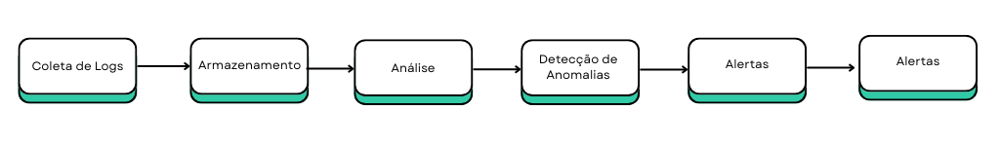

# BCGenius

\

\

**Data:** 16/08/2024

------------------------------------------------------------------------

# Sumário

-   [Introdução](#introducao)
-   [Template de Arquitetura](#template-de-arquitetura)
    -   [Requerimentos/User Stories](#requerimentosuser-stories)
    -   [Requerimentos Funcionais](#requerimentos-funcionais)
    -   [Requerimentos Não Funcionais](#requerimentos-nao-funcionais)
    -   [User Stories](#user-stories)
    -   [Arquitetura da solução](#arquitetura-solução)
-   [Análise Exploratória e de Governança de Dados](#analise-exploratoria-e-de-governanca-de-dados)
    -   [Variáveis e Pontos Estratégicos](#variaveis-e-pontos-estrategicos-30-pontos)
    -   [Representação Gráfica dos Dados - Data Visualization](#representacao-grafica-dos-dados-data-visualization-30-pontos)
    -   [Discovery dos Dados](#discovery-dos-dados-10-pontos)
    -   [Características e Justificativas de Estruturação dos Dados](#caracteristicas-e-justificativas-de-estruturacao-dos-dados-10-ponto)
-   Arquitetura de Negócio
    -   [Governança de Dados](#Governança)
    -   [Políticas de Uso dos Dados](#Políticas)
    -   [Medição da Qualidade dos Dados](#Medição)

# Introdução

O nosso projeto visa solucionar a comunicação deficiente entre o setor corporativo e as lojas da CosmeticCo, especialmente em relação aos complexos modelos de remuneração variável, que têm gerado alto turnover e baixo engajamento dos vendedores. O objetivo é desenvolver um pipeline com políticas de governança de dados, resultando em um DataApp que ofereça visualizações hiper personalizadas para gerentes e vendedores. Essa ferramenta aumentará a performance e o engajamento dos vendedores, utilizando diferentes bases de dados da área de operações para análises detalhadas e acessíveis.

------------------------------------------------------------------------

# Template de Arquitetura {#template-de-arquitetura}

### User Stories e Requisitos da Aplicação {#userStorie}

| **User Stories**                                                                                   | **Requisitos Funcionais**                                                                                                                                                                                        | **Requisitos não funcionais**                                                                                                                                           |
|-------------------|------------------------------|-----------------------|
| Como gerente de loja, quero visualizar as projeções de vendas e remuneração da minha equipe.       | A ferramenta deve permitir que gerentes visualizem projeções de vendas e remuneração, com filtros por período.                                                                                                   | Criptografia adequada para proteger dados pessoais e de desempenho.                                                                                                     |
| Como vendedor, quero acessar informações personalizadas sobre minhas vendas e remuneração.         |                                                                                                                                                                                                                  | Desempenho e Escalabilidade: Processamento em tempo real de grandes volumes de dados.                                                                                   |
| Como gerente de loja, quero receber recomendações de produtos para maximizar o cross-sell.         | A ferramenta deve fornecer recomendações personalizadas de produtos frequentemente vendidos juntos.                                                                                                              |                                                                                                                                                                         |
| Como vendedor, quero saber quais produtos têm a maior margem de lucro.                             | A ferramenta deve exibir produtos com as maiores margens de lucro, personalizadas para cada vendedor.                                                                                                            |                                                                                                                                                                         |
| Como gerente de loja, quero comparar o desempenho da minha loja com outras lojas.                  | A ferramenta deve permitir que os gerentes comparem o desempenho de sua loja com outras, oferecendo destaques nas áreas de melhoria.                                                                             |                                                                                                                                                                         |
| Como gerente de loja, quero que a ferramenta seja fácil de usar e acessível em dispositivos.       | A ferramenta deve ser acessível via dispositivos móveis, com uma interface intuitiva e responsiva, compatível com diferentes sistemas operacionais.                                                              | Disponibilidade: A ferramenta deve estar disponível 24/7 com redundância de servidores.                                                                                 |
| Como gerente de loja, quero receber alertas automáticos sobre produtos com baixa performance.      | A ferramenta deve enviar notificações automáticas aos gerentes sobre produtos com desempenho de vendas abaixo da média, com sugestões de ações corretivas.                                                       | Usabilidade: A interface deve ser fácil de navegar e incluir tutoriais ou ajuda integrada.                                                                              |
| Como vendedor, quero acessar um histórico das minhas vendas e desempenho ao longo do tempo.        | A ferramenta deve permitir que vendedores acessem um histórico detalhado de suas vendas e desempenho, visualizando dados por diferentes períodos.                                                                | Compatibilidade: A ferramenta deve ser compatível com diferentes navegadores e dispositivos, garantindo uma experiência de usuário consistente em todas as plataformas. |
| Como gerente de loja, quero personalizar os relatórios de desempenho que compartilho com a equipe. | Gerentes devem poder personalizar relatórios de desempenho, selecionando métricas específicas e criando visões customizadas para compartilhar com a equipe.                                                      | Tempo de Resposta dos Alertas: Os alertas automáticos devem ser enviados em tempo real, com um tempo de resposta de no máximo 1 minuto.                                 |
| Como vendedor, quero receber sugestões de produtos para promover com base nas tendências atuais.   | A ferramenta deve fornecer sugestões de produtos para os vendedores promoverem, baseadas em dados de vendas atuais e tendências de mercado.                                                                      | Retenção de Dados: A ferramenta deve manter um histórico de dados de vendas e desempenho por um período mínimo.                                                         |
| Como gerente de loja, quero ter acesso a um dashboard com as principais métricas de desempenho.    | Dashboard de Desempenho Consolidado: A ferramenta deve oferecer um dashboard onde os gerentes possam visualizar todas as principais métricas de desempenho da loja, de forma consolidada e fácil de interpretar. | Configuração de Alertas e Relatórios: A ferramenta deve permitir que gerentes configurem alertas e personalizem relatórios sem necessidade de suporte técnico.          |
|                                                                                                    |                                                                                                                                                                                                                  | Atualização Frequente de Sugestões e Dashboards: Sugestões de produtos e dashboards devem ser atualizados diariamente para refletir mudanças nas tendências de vendas.  |
|                                                                                                    |                                                                                                                                                                                                                  | Escalabilidade Horizontal: A ferramenta deve suportar a adição de novas lojas e usuários sem comprometer o desempenho.                                                  |

## Arquitetura da solução {#arquitetura-solução}

# Arquitetura do DataApp


### Arquitetura do DataApp: Fluxo de Dados, Processamento, Armazenamento, Segurança, Análise e Visualização

Esta arquitetura descreve o fluxo de dados, processamento, armazenamento, segurança, análise e visualização no DataApp, desenvolvido para otimizar a análise de dados e a tomada de decisões em uma organização.

## 1. Ingestão de Dados

### **Ingestão de Dados RAW**

A primeira etapa do processo é a **Ingestão de Dados RAW**, onde os dados brutos são coletados de várias fontes e inseridos no sistema para processamento posterior. Esses dados podem incluir transações, logs, e outras formas de dados não estruturados que serão processados em etapas subsequentes.

## 2. Processamento de Dados

### **Validação de Colunas e Processamento Inicial**

Após a ingestão, os dados passam por uma **Validação de Colunas e Processamento Inicial**. Utilizando a linguagem **R**, esta fase garante que os dados estejam estruturados corretamente, identificando e corrigindo problemas antes de prosseguir. Este processamento inicial também pode incluir a normalização de dados e a remoção de duplicatas.

### **Envio para o Data Lake via Kafka**

Uma vez processados, os dados são enviados para o **Data Lake**. O **Apache Kafka** é utilizado para gerenciar o fluxo de dados, proporcionando alta disponibilidade e consistência durante a transmissão. O Data Lake atua como um repositório centralizado para armazenar dados em seu estado bruto, permitindo fácil acesso para análises e transformações subsequentes.

### **ETL (Extract, Transform, Load)**

Dentro do Data Lake, os dados brutos são submetidos a um processo de **ETL (Extract, Transform, Load)**. Utilizando o **Apache Spark**, os dados são extraídos, transformados e carregados no **Data Warehouse**. Durante essa fase, as ferramentas de ETL garantem que os dados sejam limpos, estruturados, e otimizados para consultas analíticas. O **Apache Nifi** é integrado para facilitar o gerenciamento e automação dos fluxos de dados entre diferentes sistemas.

## 3. Armazenamento de Dados

### **Limpeza e Validação Adicional**

Antes de serem armazenados definitivamente no Data Warehouse, os dados passam por uma **Limpeza e Validação Adicional**. Esta etapa assegura que os dados estão prontos para análises avançadas e uso em produção. As regras de qualidade são aplicadas rigorosamente para garantir a integridade e a confiabilidade dos dados armazenados.

### **Encriptação dos Dados**

Para garantir a segurança, os dados passam por um processo de **Encriptação** antes de serem armazenados no **Data Warehouse**. Isso protege os dados em repouso, cumprindo com regulamentações de proteção de dados e prevenindo acessos não autorizados.

### **Armazenamento no Data Warehouse (ClickHouse)**

Os dados validados e encriptados são então armazenados no **Data Warehouse** utilizando o **ClickHouse**. Este banco de dados colunar é altamente eficiente para processamento de grandes volumes de dados, oferecendo suporte rápido e escalável para análises complexas e consultas em tempo real.

## 4. Análise e Modelagem

### **Desencriptação e Análise Avançada**

Os dados armazenados no Data Warehouse são desencriptados conforme necessário para **Análise Avançada**. **SciPy** é empregado para realizar análises estatísticas e execuções de algoritmos matemáticos avançados, permitindo a geração de insights detalhados e previsões precisas.

### **Treinamento de Modelos**

Os dados disponíveis também são utilizados para **Treinamento de Modelos Preditivos**. Com o uso de **Scikit-learn**, modelos preditivos são desenvolvidos e implementados para antecipar tendências e apoiar a tomada de decisões estratégicas.

## 5. Visualização e Relatórios

### **Dashboards Interativos (Streamlit)**

Os resultados das análises são apresentados através de **Dashboards Interativos** criados com **Streamlit**. Esta ferramenta permite a criação de interfaces dinâmicas que facilitam a exploração dos dados e a visualização dos resultados em tempo real, sendo essencial para monitoramento contínuo e avaliações rápidas.

### **Relatórios Detalhados (Power BI)**

Além dos dashboards, relatórios detalhados são gerados utilizando **Power BI**. Esses relatórios consolidam as informações e as apresentam de maneira compreensível para os usuários finais, oferecendo insights acionáveis e facilitando a comunicação entre diferentes níveis da organização.

## 6. Deploy e Infraestrutura

### **Pipeline de Deploy Automatizado**

A infraestrutura para o DataApp é gerenciada através de um **Pipeline de Deploy** automatizado, construído com **Terraform**. Este pipeline lida com a criação e o gerenciamento de recursos na **AWS**, garantindo consistência e permitindo que as atualizações sejam facilmente implementadas.

### **Gerenciamento e Controle Contínuos**

O deploy das aplicações, incluindo os dashboards e relatórios, é realizado na **AWS**. O **Gerenciamento e Controle Contínuos** do ambiente asseguram que o sistema funcione conforme o esperado, com monitoramento, manutenção e atualizações regulares. Isso inclui a utilização de containers Docker para garantir que as aplicações sejam portáveis e possam ser executadas em qualquer ambiente com consistência.

### **Autenticação e Controle de Acesso**

O acesso ao sistema é protegido por **Autenticação** robusta, garantindo que somente usuários autorizados possam acessar dados sensíveis e realizar operações críticas. As políticas de controle de acesso são aplicadas para garantir que os dados e processos estejam protegidos contra acessos não autorizados.

## Conclusão

Esta arquitetura foi desenhada para ser robusta, modular e escalável, proporcionando um fluxo eficiente de dados desde a ingestão até a análise e visualização. O uso das tecnologias como **Kafka**, **Spark**, **ClickHouse**, e **Terraform** oferece um ambiente otimizado para análises avançadas, garantindo segurança e performance em todas as etapas do processo. A abordagem centrada em dashboards interativos e relatórios detalhados facilita a tomada de decisões informadas, aumentando a eficácia e agilidade da organização.

------------------------------------------------------------------------


## Variáveis e Pontos Estratégicos

-   Importando as Bibliotecas Necessárias

As bibliotecas utilizadas têm como objetivo facilitar o tratamento de dados, a criação de novos datasets e a geração de gráficos.

```{r setup}
knitr::opts_chunk$set(echo = TRUE, warning=FALSE, message=FALSE)
library(dplyr)
library(tidyr)
library(tibble)
library(ggplot2)
library(corrplot)
# library(FactoMineR)
# library(factoextra)
```

-   Carregamento dos Datasets para Análise

Nesta análise exploratória, o dataset de transações de 2024 é carregado e relacionado a outros conjuntos de dados. A utilização do `as_tibble` facilita a visualização no console e reduz a ocorrência de erros na manipulação de colunas.

```{r loading datasets}
`2024` <- read.csv("./../src/data/raw/2024.csv", encoding = "ISO-8859-1")
store_final <- read.csv("./../src/data/raw/store_final.csv", encoding = "ISO-8859-1")
target_store_final <- read.csv("./../src/data/raw/target_store_final.csv", encoding = "ISO-8859-1")
sku_status_dataset <- read.csv("./../src/data/raw/sku_status_dataset.csv", encoding = "ISO-8859-1")
targets_salesperson_final <- read.csv("../../src/data/raw/targets_salesperson_final.csv", encoding = "ISO-8859-1")
sku_price <- read.csv("./../src/data/raw/sku_price.csv", encoding = "ISO-8859-1")
sku_dataset <- read.csv("./../src/data/raw/sku_dataset.csv", encoding = "ISO-8859-1", sep = ";")
sku_cost <- read.csv("./../src/data/raw/sku_cost.csv", encoding = "ISO-8859-1")
employee_final <- read.csv("./../src/data/raw/employee_final.csv", encoding = "ISO-8859-1")

`2024` <- as_tibble(`2024`)
store_final <- as_tibble(store_final)
target_store_final <- as_tibble(target_store_final)
sku_status_dataset <- as_tibble(sku_status_dataset)
targets_salesperson_final <- as_tibble(targets_salesperson_final)
sku_price <- as_tibble(sku_price)
sku_dataset <- as_tibble(sku_dataset)
sku_cost <- as_tibble(sku_cost)
employee_final <- as_tibble(employee_final)
```

-   Visualizando as Primeiras Linhas dos Dados

As primeiras linhas dos datasets são apresentadas a seguir para facilitar a visualização inicial.

```{r read first rows}
head(`2024`)
head(store_final)
head(target_store_final)
head(sku_status_dataset)
head(targets_salesperson_final)
head(sku_price)
head(sku_dataset)
head(sku_cost)
head(employee_final)
```

-   Verificação da Estrutura dos Dados

A função `str` é utilizada para examinar informações sobre as colunas dos datasets, como o tipo de dados e o número de caracteres.

```{r}
str(`2024`)
```

```{r}
str(store_final)
```

```{r}
str(target_store_final)
```

```{r}
str(sku_status_dataset)
```

```{r}
str(targets_salesperson_final)
```

```{r struct datas}
str(employee_final)
```

```{r}
str(sku_price)
```

```{r}
str(sku_dataset)
```

```{r}
str(sku_cost)
```

-   Resumo Estatístico

A função `summary()` é utilizada para gerar um resumo estatístico das variáveis, incluindo valores mínimos, máximos, médias e quantidades.

```{r summary datas}
summary(`2024`)
```

```{r}
summary(store_final)
```

```{r}
summary(target_store_final)
```

```{r}
summary(sku_status_dataset)
```

```{r}
summary(targets_salesperson_final)
```

```{r}
summary(sku_price)
```

```{r}
summary(sku_dataset)
```

```{r}
summary(sku_cost)
```

```{r}
summary(employee_final)
```

-   Descrição das Variáveis

**2024**

| Coluna            | Tipo      | Descrição                         |
|-------------------|-----------|-----------------------------------|
| **data**          | Character | Data da transação                 |
| **cod_vendedor**  | Numérico  | Código identificador do vendedor  |
| **cod_loja**      | Character | Código identificador da loja      |
| **cod_transacao** | Character | Código identificador da transação |
| **quantidade**    | Numérico  | Quantidade de itens vendidos      |
| **cod_prod**      | Numérico  | Código identificador do produto   |
| **preco**         | Numérico  | Preço do produto                  |

**store_final**

| Coluna               | Tipo      | Descrição                          |
|----------------------|-----------|------------------------------------|
| **nome_loja**        | Character | Nome da loja                       |
| **regiao**           | Character | Região onde a loja está localizada |
| **diretoria**        | Character | Diretoria responsável pela loja    |
| **data_inauguracao** | Character | Data de inauguração da loja        |

**target_store_final**

| Coluna           | Tipo      | Descrição                    |
|------------------|-----------|------------------------------|
| **month**        | Character | Mês da meta de vendas        |
| **store_id**     | Character | Código identificador da loja |
| **sales_target** | Numérico  | Meta de vendas para a loja   |

**sku_status_dataset**

| Coluna          | Tipo      | Descrição                                       |
|-------------------|-------------------|----------------------------------|
| **cod_prod**    | Numérico  | Código identificador do produto                 |
| **data_inicio** | Character | Data de início da validade do status do produto |
| **data_fim**    | Character | Data de fim da validade do status do produto    |

**targets_salesperson_final**

| Coluna           | Tipo      | Descrição                           |
|------------------|-----------|-------------------------------------|
| **id_employee**  | Numérico  | Código identificador do funcionário |
| **sales_target** | Numérico  | Meta de vendas para o funcionário   |
| **month**        | Character | Mês da meta de vendas               |

**sku_price**

| Coluna          | Tipo      | Descrição                                      |
|-------------------|-------------------|----------------------------------|
| **cod_prod**    | Numérico  | Código identificador do produto                |
| **data_inicio** | Character | Data de início da validade do preço do produto |
| **data_fim**    | Character | Data de fim da validade do preço do produto    |
| **preco**       | Numérico  | Preço do produto                               |

**sku_dataset**

| Coluna              | Tipo      | Descrição                       |
|---------------------|-----------|---------------------------------|
| **cod_prod**        | Numérico  | Código identificador do produto |
| **nome_abrev**      | Character | Nome abreviado do produto       |
| **nome_completo**   | Character | Nome completo do produto        |
| **descricao**       | Character | Descrição do produto            |
| **categoria**       | Character | Categoria do produto            |
| **sub_categoria**   | Character | Subcategoria do produto         |
| **marca**           | Character | Marca do produto                |
| **conteudo_valor**  | Character | Valor do conteúdo do produto    |
| **conteudo_medida** | Character | Medida do conteúdo do produto   |

**sku_cost**

| Coluna          | Tipo      | Descrição                                      |
|-------------------|-------------------|----------------------------------|
| **cod_prod**    | Numérico  | Código identificador do produto                |
| **data_inicio** | Character | Data de início da validade do custo do produto |
| **data_fim**    | Character | Data de fim da validade do custo do produto    |
| **custo**       | Numérico  | Custo do produto                               |

**employee_final**

| Coluna           | Tipo      | Descrição                                                |
|-------------------|-------------------|----------------------------------|
| **id_employee**  | Numérico  | Código identificador do funcionário                      |
| **name**         | Character | Nome do funcionário                                      |
| **surname**      | Character | Sobrenome do funcionário                                 |
| **cpf**          | Character | CPF do funcionário                                       |
| **status**       | Character | Status do funcionário (ativo/inativo)                    |
| **role**         | Character | Função/cargo do funcionário                              |
| **initial_date** | Character | Data de início do contrato do funcionário                |
| **end_date**     | Character | Data de término do contrato do funcionário               |
| **store_id**     | Character | Código identificador da loja onde o funcionário trabalha |

-   **Reduzindo a Quantidade do Dataset**

Para facilitar a análise e reduzir a necessidade de processamento, foi selecionada uma amostra menor dos dados, garantindo a reprodutibilidade com uma seed.

```{r reducing data}
set.seed(123)  # Para garantir reprodutibilidade
`2024_sample` <- `2024` %>% sample_frac(0.05)
```

# Análise Univariada

Nesta seção, são realizados tratamentos específicos para analisar os valores dos datasets, identificando médias, out

liers e possíveis insights para recomendações de produtos.

```{r}
# Criar uma nova base de dados com a junção das tabelas
merged_data <- `2024` %>%
  inner_join(sku_dataset, by = "cod_prod") %>%
  group_by(nome_abrev) %>%
  summarise(
    quantidade_total = sum(quantidade),
    preco_total = sum(preco)
  ) %>%
  arrange(desc(quantidade_total)) %>%
  head(30) 

# Criar uma coluna de siglas no sku_dataset
sku_dataset <- sku_dataset %>%
  mutate(sigla_prod = substr(nome_abrev, 1, 2))

# Filtrar os top 30 produtos mais vendidos
top_30_cod_prod <- `2024` %>%
  group_by(cod_prod) %>%
  summarise(total_vendas = sum(quantidade)) %>%
  arrange(desc(total_vendas)) %>%
  slice(1:30) %>%
  pull(cod_prod)

`2024_top_30` <- `2024` %>%
  filter(cod_prod %in% top_30_cod_prod)
```

```{r visualization charts}

# Histograma para a variável quantidade
ggplot(`2024`, aes(x = quantidade)) +
  geom_histogram(binwidth = 1, fill = "blue", color = "black") +
  labs(title = "Distribuição de Quantidade", x = "Quantidade", y = "Frequência")
```

```{r}
# Gráfico de densidade para a variável preço
ggplot(`2024`, aes(x = preco)) +
  geom_density(fill = "green", alpha = 0.5) +
  labs(title = "Densidade do Preço", x = "Preço", y = "Densidade")
```

```{r}
# Gráfico de densidade para a variável cod_prod (top 30 produtos mais vendidos)
ggplot(`2024_top_30`, aes(x = factor(cod_prod, levels = top_30_cod_prod), group = cod_prod)) +
  geom_density(fill = "purple", alpha = 0.5) +
  labs(title = "Densidade de Vendas por Produto (Top 30)", x = "Sigla do Produto", y = "Densidade") +
  theme_minimal() +
  scale_x_discrete(labels = function(x) sku_dataset$sigla_prod[match(x, sku_dataset$cod_prod)])
```

```{r}
# Boxplot para a variável preço
ggplot(`2024`, aes(y = preco)) +
  geom_boxplot(fill = "orange") +
  labs(title = "Boxplot do Preço", y = "Preço")
```

```{r}
# Boxplot para a variável regiao
ggplot(store_final, aes(x = regiao)) +
  geom_bar(fill = "purple") +
  labs(title = "Distribuição de Regiões", x = "Região", y = "Contagem")
```

```{r}
# Gráfico de densidade para a variável preco
ggplot(sku_price, aes(x = preco)) +
  geom_density(fill = "blue", alpha = 0.5) +
  labs(title = "Densidade do Preço dos Produtos", x = "Preço", y = "Densidade")
```

```{r}
# Boxplot para a variável preco
ggplot(sku_price, aes(y = preco)) +
  geom_boxplot(fill = "orange") +
  labs(title = "Boxplot do Preço dos Produtos", y = "Preço")
```

```{r}
# Gráfico de densidade para a variável custo
ggplot(sku_cost, aes(x = custo)) +
  geom_density(fill = "green", alpha = 0.5) +
  labs(title = "Densidade do Custo dos Produtos", x = "Custo", y = "Densidade")
```

```{r}
# Boxplot para a variável custo
ggplot(sku_cost, aes(y = custo)) +
  geom_boxplot(fill = "purple") +
  labs(title = "Boxplot do Custo dos Produtos", y = "Custo")
```

```{r}
# Histograma para a variável sales_target
ggplot(targets_salesperson_final, aes(x = sales_target)) +
  geom_histogram(binwidth = 5000, fill = "red", color = "black") +
  labs(title = "Distribuição da Meta de Vendas dos Funcionários", x = "Meta de Vendas", y = "Frequência")
```

```{r}
# Boxplot para a variável role
ggplot(employee_final, aes(x = role)) +
  geom_bar(fill = "blue") +
  labs(title = "Distribuição de Funções/Cargos", x = "Função/Cargo", y = "Contagem")
```

```{r}
# Boxplot para identificar outliers na variável quantidade
ggplot(`2024`, aes(y = quantidade)) +
  geom_boxplot(fill = "orange") +
  labs(title = "Boxplot da Quantidade", y = "Quantidade")
```

```{r}
# Boxplot para identificar outliers na variável preço
ggplot(`2024`, aes(y = preco)) +
  geom_boxplot(fill = "orange") +
  labs(title = "Boxplot do Preço", y = "Preço")
```

```{r}
# Boxplot para identificar outliers na variável preco
ggplot(sku_price, aes(y = preco)) +
  geom_boxplot(fill = "blue") +
  labs(title = "Boxplot do Preço dos Produtos", y = "Preço")
```

-   **Identificação de Outliers**

```{r}
preco_outliers <- `2024` %>%
  filter(preco < quantile(preco, 0.25) - 1.5 * IQR(preco) | preco > quantile(preco, 0.75) + 1.5 * IQR(preco))
```

```{r}
preco_outliers_sku <- sku_price %>%
  filter(preco < quantile(preco, 0.25) - 1.5 * IQR(preco) | preco > quantile(preco, 0.75) + 1.5 * IQR(preco))
```

##### Outliers na variável preço:

```{r}
print(preco_outliers)
```

##### Outliers na variável preço dos produtos:

```{r}
print(preco_outliers_sku)
```

# Análise Bivariada

A análise busca entender a relação entre diferentes variáveis do dataset, como quantidade e preço, e como essas variáveis se comportam em diferentes lojas.

```{r}
set.seed(123)  # Para garantir reprodutibilidade
`2024_sample` <- `2024` %>% sample_frac(0.50)
```

```{r}
# Gráfico de dispersão para explorar a relação entre quantidade e preço
ggplot(`2024_sample`, aes(x = quantidade, y = preco)) +
  geom_point(alpha = 0.6) +
  labs(title = "Dispersão entre Quantidade e Preço", x = "Quantidade", y = "Preço")
```

```{r}
# Criar uma coluna de siglas para as lojas, pegando as duas primeiras letras de cada palavra
`2024_sample` <- `2024_sample` %>%
  mutate(sigla_loja = sapply(strsplit(cod_loja, " "), function(x) paste(substr(x, 1, 2), collapse = "")))

# Gráfico de barras para explorar a relação entre cod_loja e quantidade com siglas
ggplot(`2024_sample`, aes(x = reorder(sigla_loja, -quantidade), y = quantidade)) +
  geom_bar(stat = "identity", fill = "blue") +
  labs(title = "Quantidade Vendida por Loja", x = "Código da Loja (Sigla)", y = "Quantidade") +
  theme_minimal() +
  theme(axis.text.x = element_text(angle = 45, hjust = 1))
```

# Análise de Componentes Principais (PCA)

A PCA é uma técnica de redução de dimensionalidade que transforma um conjunto de variáveis possivelmente correlacionadas em um conjunto menor de variáveis não correlacionadas, chamadas de componentes principais. Essa transformação é feita de forma a preservar a maior parte da variância dos dados originais nos primeiros componentes principais.

```{r PCA}
# Seleção das variáveis numéricas e remoção de NAs na amostra
numeric_vars_sample_2024 <- `2024_sample` %>% 
  select_if(is.numeric) %>%
  na.omit()

pca_result_2024 <- prcomp(numeric_vars_sample_2024, scale. = TRUE)
```

```{r}
summary(pca_result_2024)
```

```{r}
fviz_eig(pca_result_2024, addlabels = TRUE, ylim = c(0, 50))
```

```{r}
fviz_pca_var(pca_result_2024, 
             col.var = "contrib",
             gradient.cols = c("#00AFBB", "#E7B800", "#FC4E07"),
             repel = TRUE)
```

# Conclusão e Discussão

A análise realizada ofereceu várias percepções importantes sobre os dados de transações de 2024.

**Distribuição de Quantidade e Preço:** A distribuição da quantidade vendida apresenta ampla variação, com alguns produtos mostrando altos volumes de vendas. O gráfico de densidade do preço revelou que a maioria dos

preços dos produtos está concentrada em uma faixa específica (entre 0 a 200), indicando uma estrutura de preços relativamente uniforme, com algumas exceções notáveis (possíveis outliers e exceções).

**Identificação de Outliers:** A análise de outliers indicou que alguns dados aparentam ser outliers de forma significativa, sugerindo a possibilidade de tratamento inadequado ou entrada de dados incorreta. Produtos com características únicas também podem estar influenciando os resultados.

**Análise Bivariada:** A relação entre quantidade e preço mostrou que produtos mais caros não necessariamente resultam em maior quantidade vendida. Além disso, o gráfico de barras revelou quais lojas têm maiores volumes de vendas, gerando interesse em investigar os fatores que levam algumas lojas a venderem mais que outras.

## Discussão sobre Limitações e Possíveis Melhorias

Durante a análise, algumas limitações e áreas para melhorias foram identificadas. A amostra reduzida do dataset foi uma escolha para minimizar o tempo de processamento e facilitar a execução das análises; no entanto, essa redução pode ter comprometido a representatividade dos dados e a robustez dos resultados. Idealmente, um conjunto de dados mais extenso e completo deveria ser utilizado para garantir maior precisão nas análises.

Outra limitação foi o tratamento inadequado de alguns datasets, o que pode ter impactado a qualidade das análises. A falta de pré-processamento e tratamento específico dos dados pode ter afetado as visualizações e as inferências feitas. Isso é especialmente importante quando se trabalha com dados provenientes de múltiplas fontes e com diferentes níveis de detalhe, como preços e custos de produtos.

## Características e Justificativas de Estruturação dos Dados

Os dados são coletados em formato CSV e contém informações importantes para o desenvolvimento do projeto como ID do vendedor, nome, e histórico de vendas. Optamos por seguir com essa estruturação temporariamente devido à sua simplicidade e facilidade de manipulação:

```{r pressure, echo=FALSE}
#carregamento de dados 
employee_final <-read.csv("employee_final.csv") 
sku_cost<-read.csv("sku_cost.csv") 
sku_dataset <-read.csv("sku_dataset.csv", sep = ";") 
sku_price <-read.csv("sku_price.csv") 
sku_status_dataset<-read.csv("sku_status_dataset.csv", sep = ";") 
target_store_final_v3 <-read.csv("target_store_final_v3.csv") 
targets_salesperson_final_v3 <-read.csv("targets_salesperson_final_v3.csv") 
targets_salesperson_final <-read.csv("targets_salesperson_final.csv") 
```

## Dataset employee_final

Este dataset contém informações detalhadas sobre os colaboradores da empresa, como identificação, status de atividade, cargo, e localização.

**id_employee:** Identificador único de cada vendedor, fundamental para rastrear as atividades de cada um dentro do sistema.

**name e surname:** Dados pessoais dos vendedores, não influencia diretamente nas decisões de sugestão de produtos ou avaliação de desempenho.

**cpf:** Documento único de identificação no Brasil.

**status**: Indicador do estado atual do vendedor (ativo, inativo, etc.). Essencial para filtrar vendedores que devem ser considerados nas análises e nos relatórios.

**role:** Função ou cargo do vendedor na empresa. Pode ser utilizada para diferenciar tipos de vendedores, permitindo análises segmentadas e sugestão de produtos mais apropriados para cada perfil.

**initial_date e end_date:** Datas de início e término de contrato ou vínculo do vendedor. Importantes para medir o tempo de serviço e avaliar o desempenho ao longo do tempo, além de identificar períodos de atividade para análise de engajamento.

**store_id:**Identificador da loja onde o vendedor atua. Permite análises específicas por localidade, identificando quais produtos são mais vendidos em certas regiões e ajustando as sugestões de produtos de acordo com a demanda local.

```{r }
summary(employee_final)
```

## Dataset sku_cost

Contém informações sobre o custo dos produtos, períodos de disponibilidade para venda e identificadores únicos dos produtos.

-   **cod_prod (Código do Produto)**:Este código é um identificador único para cada produto no sistema. Ele é essencial para rastrear quais produtos estão sendo vendidos, suas características, e como eles estão performando em termos de vendas e lucratividade. Usado para identificar e sugerir produtos que mais saem e que têm maior margem de lucro, auxiliando na estratégia de vendas.

-   **data_inicio e data_fim (Datas de Início e Fim de Vendas)**:As datas de início e fim indicam o período em que o produto esteve disponível para venda. Isso ajuda a entender a janela de tempo de cada produto no mercado. Essenciais para determinar a relevância temporal do produto. Produtos que tiveram bom desempenho em um período específico podem ser analisados para ver se devem ser sugeridos novamente ou se há sazonalidades a serem consideradas.

-   **custo (Custo do Produto)**: O custo é um fator crítico para calcular a margem de lucro de cada produto. Ele ajuda a entender a lucratividade real dos produtos vendidos. Usado para sugerir produtos com maior margem de lucro, garantindo que os vendedores priorizem itens que maximizem o retorno financeiro.

```{r }
summary(sku_cost)
```

## Dataset sku_dataset

Aqui encontramos detalhes descritivos e classificatórios dos produtos, como nomes, descrições, categorias e marcas.

**cod_prod (Código do Produto):** O código do produto é uma chave única que identifica cada item no banco de dados. Ele é essencial para vincular outras informações relevantes, como vendas, margens de lucro e engajamento dos vendedores. É a base para qualquer análise específica de produto.Garante que os dados sobre produtos, como nome, categoria, e vendas, sejam corretamente associados e evitam confusões entre produtos semelhantes.

**nome_abrev (Nome Abreviado)**Fornece uma versão curta do nome do produto, útil em relatórios e interfaces onde o espaço é limitado. Facilita a visualização e manipulação de dados, especialmente em displays compactos, como dashboards e relatórios resumidos.

**nome_completo (Nome Completo):** Contém o nome completo e descritivo do produto, que é importante para uma compreensão clara e precisa por parte dos vendedores e gerentes. Auxilia na identificação detalhada dos produtos, permitindo uma melhor comunicação e precisão na sugestão de produtos.

**descricao (Descrição):** Fornece detalhes adicionais sobre o produto, que podem incluir especificações, usos recomendados, ou diferenciais importantes. Enriquece o entendimento dos produtos, ajudando a convencer os vendedores sobre quais produtos promover com base em características específicas.

**categoria (Categoria):** Agrupa os produtos em grandes grupos, como "eletrônicos" ou "alimentos", permitindo análises e sugestões em nível macro. Facilita a segmentação dos produtos e pode ser usada para identificar categorias que estão em alta, informando decisões estratégicas sobre quais categorias priorizar.

**sub_categoria (Subcategoria)**Refinamento da categoria, fornecendo uma classificação mais específica dentro das categorias principais, como "smartphones" dentro de "eletrônicos". Permite sugestões mais direcionadas, otimizando as recomendações de produtos dentro de segmentos específicos, o que pode melhorar as taxas de vendas.

**marca (Marca):** A marca é um atributo importante para muitos consumidores, influenciando suas decisões de compra. A análise por marca pode ajudar a identificar quais marcas têm melhor desempenho e quais podem ser melhor promovidas, otimizando as estratégias de venda.

**conteudo_valor (Valor do Conteúdo)** Este campo provavelmente se refere à quantidade ou volume do produto, como "500ml" ou "1kg". É importante para entender o valor oferecido ao cliente e pode influenciar a margem de lucro, sendo um fator chave na recomendação de produtos que oferecem maior valor.

**conteudo_medida (Unidade de Medida)**Especifica a unidade de medida para o conteúdo do produto, como "ml", "g", ou "unidade". Garante que o valor do conteúdo seja corretamente interpretado e comparado, essencial para cálculos precisos de estoque, preço e margem de lucro.

```{r }
summary(sku_dataset)
```

## Dataset sku_price

Contém informações sobre preços dos produtos e períodos de disponibilidade para venda.

**cod_prod** (Código do Produto): Esta variável representa o identificador único para cada produto. Permite que o sistema sugira produtos com base em seu desempenho anterior e potencial de lucro. Além disso, ajuda os gerentes a identificar quais produtos são mais atrativos para os vendedores mais engajados.

**data_inicio** e **data_fim** (Datas de Início e Fim): As variáveis `data_inicio` e `data_fim` indicam o período em que cada produto foi ou estará disponível para venda.

**preco** (Preço): é uma variável crucial, pois influencia diretamente a margem de lucro e a decisão de compra do cliente. É um dos principais fatores analisados ao sugerir produtos com maior margem de lucro.

```{r }
summary(sku_price)
```

## Dataset sku_status_dataset

Armazena o status temporal dos produtos, indicando períodos de disponibilidade e promoções.

**cod_prod**: é o identificador único dos produtos. Este campo é crucial para rastrear e referenciar os produtos em todas as análises e recomendações do sistema.

**data_inicio:** indica o início de um período de tempo relacionado ao produto, como o começo de uma promoção, disponibilidade ou início de um ciclo de vendas.

**data_fim**: marca o fim de um período relacionado ao produto, como o término de uma promoção ou disponibilidade do produto.

```{r}
summary(sku_status_dataset)
```

## Dataset target_store_final_v3

Este dataset registra as metas de vendas das lojas em diferentes meses.

**month**: Representa o mês do ano, sendo uma variável temporal crucial para análise de tendências sazonais e padrões de vendas ao longo do tempo.

**store_id**: Identifica unicamente cada loja. Essencial para segmentar dados e entender o desempenho em diferentes localizações geográficas.

**sales_target**: Refere-se à meta de vendas estabelecida para cada loja. É uma variável numérica fundamental para medir o desempenho real em comparação com o esperado.

```{r }
summary(target_store_final_v3)
```

## Dataset targets_salesperson_final_v3

Contém as metas de vendas para cada vendedor, juntamente com seus identificadores e período de avaliação.

**id_employee :** Um identificador numérico único para cada vendedor.

**sales_target :** Representa a meta de vendas que cada vendedor deve atingir em um determinado período. É crucial para medir o sucesso dos vendedores em alcançar suas metas. Ela serve como base para comparar o desempenho real versus o esperado e, assim, determinar a eficácia das estratégias de venda adotadas.

**month:** Representa o período de tempo (mês) durante o qual as metas de vendas e as vendas reais são avaliadas. É fundamental para identificar tendências sazonais, picos de vendas e comportamentos de compra ao longo do tempo.

```{r }
summary(targets_salesperson_final_v3)
```

## Dataset targets_salesperson_final

Similar ao dataset anterior, focado nas metas de vendas dos vendedores, mas com potencial para uso em diferentes períodos ou cenários.

**id_employee:** Um identificador numérico único para cada vendedor.

**sales_target:** Representa a meta de vendas que cada vendedor deve atingir em um determinado período. Essa variável é crucial para medir o sucesso dos vendedores em alcançar suas metas.

**month:** Representa o período de tempo (mês) durante o qual as metas de vendas e as vendas reais são avaliadas. É fundamental para identificar tendências sazonais, picos de vendas e comportamentos de compra ao longo do tempo.

```{r}
summary(targets_salesperson_final)
```

------------------------------------------------------------------------

# Arquitetura de Negócio

## Governança de Dados {#governança}

## 1. Introdução à governança de dados

A governança de dados é um componente vital na administração moderna de dados empresariais, especialmente em um contexto regulatório rigoroso como o que enfrentamos hoje. Para a CosmeticCo, uma empresa com uma vasta rede de lojas e uma base de mais de 600 vendedores, estabelecer uma governança de dados robusta não é apenas uma questão de eficiência operacional, mas também de conformidade legal e proteção da reputação corporativa.

# 2. Importância da LGPD

A Lei Geral de Proteção de Dados (Lei nº 13.709/2018) é a base legal que regulamenta o tratamento de dados pessoais no Brasil. No projeto de assistente de vendas para a CosmeticCo, a observância rigorosa da LGPD é crucial, pois o manuseio de dados pessoais de colaboradores, como informações de desempenho e remuneração, está diretamente envolvido. A conformidade com a LGPD não apenas evita penalidades severas, que podem chegar a 2% do faturamento da empresa, limitadas a R\$ 50 milhões por infração, mas também fortalece a confiança dos empregados e clientes na capacidade da empresa de proteger seus dados.

# 3. Definição de acesso aos dados

Um dos princípios fundamentais da LGPD é a limitação de acesso aos dados com base no "need-to-know", ou seja, os dados devem ser acessíveis apenas para aqueles que realmente necessitam deles para desempenhar suas funções. Dentro do contexto trabalhado, temos então que:

-   **Vendedores e gerentes** terão acesso exclusivamente às suas próprias métricas de desempenho, como projeções de vendas e comparativos com outros vendedores, garantindo que informações sensíveis não sejam indevidamente expostas.
-   **Manutenção (TI e engenharia de dados)** terá acesso às bases de dados brutas e intermediárias para garantir a operação eficiente e segura do pipeline de dados. No entanto, esse acesso será monitorado e registrado para garantir a integridade e a segurança dos dados.
-   **Desenvolvedores (analistas de dados)** terão acesso a conjuntos de dados anonimizados ou pseudonimizados, permitindo análises detalhadas sem comprometer a privacidade dos titulares dos dados.

# 4. Políticas de segurança

As políticas de segurança adotadas no projeto são fundamentadas nos princípios de confidencialidade, integridade e disponibilidade (CIA triad), conforme descrito no NIST SP 800-53 e na ISO/IEC 27001.

-   **Confidencialidade**: Será implementada autenticação multifatorial (MFA) para todos os acessos aos sistemas de dados, conforme as melhores práticas recomendadas pelo NIST. Além disso, políticas de senha robustas e criptografia AES-256 para o armazenamento de dados sensíveis serão adotadas.
-   **Integridade**: Utilizaremos controles de versão e revisões para garantir que os dados permaneçam íntegros ao longo de todo o seu ciclo de vida. A integridade dos dados também será mantida através da implementação de checksums e hashes criptográficos, conforme recomendado pela ISO/IEC 27002.
-   **Disponibilidade**: A disponibilidade dos dados será assegurada através de sistemas de backup contínuo, utilizando soluções de armazenamento em nuvem e infraestrutura através da AWS. Planos de recuperação de desastres serão implementados, incluindo testes periódicos de failover para garantir a continuidade dos negócios em caso de incidentes.

# 5. Processos de auditoria e compliance

A conformidade com a LGPD será verificada por meio de auditorias regulares, que avaliarão a adesão às políticas de acesso, armazenamento e processamento de dados. Essas auditorias seguirão um cronograma anual e utilizarão frameworks reconhecidos, como o COBIT 5 (COBIT 5: a business framework for the governance and management of enterprise IT), para garantir que todos os aspectos de governança e compliance sejam abordados. Qualquer não conformidade deve ser rapidamente tratada através de um processo de correção documentado, garantindo que a empresa esteja sempre em linha com as exigências legais vigentes.

# 6. Anonimização e pseudonimização dos dados

Em conformidade com os artigos 12 e 13 da LGPD, dados pessoais serão anonimizados sempre que possível. Isso significa que os dados serão transformados de forma que não possam ser associados a um indivíduo específico sem o uso de informações adicionais, que serão mantidas separadamente e protegidas. Nos casos em que a anonimização completa não for viável, será aplicada a pseudonimização, que reduz significativamente os riscos associados ao tratamento de dados pessoais, limitando o impacto de eventuais violações de dados.

# 7. Treinamentos

A conscientização é uma parte crítica (e elementar) da governança de dados. É recomendado que a empresa implemente para todos envolvidos no projeto a participação em treinamentos regulares sobre a LGPD e as melhores práticas de manuseio de dados. Este treinamento deve incluir não apenas a legislação aplicável, mas também estudos de caso de violações de dados, reforçando a importância da conformidade e os riscos associados a falhas. Esses treinamentos devem ser obrigatórios e periódicos, com avaliações para garantir a compreensão e a aplicação correta das políticas.

# 8. Revisão e atualização contínua

Em complementaridade ao tópico acima, governança de dados não é estática e deve ser adaptada continuamente para responder a novas ameaças, tecnologias e alterações regulatórias. A cada seis meses, a estrutura de governança será revisada, e atualizações serão implementadas conforme necessário. Esta revisão incluirá uma análise completa das políticas de acesso, segurança e compliance, bem como a adaptação às novas diretrizes regulamentares que possam surgir.

# Conclusão

A estrutura de governança de dados delineada aqui garante que o projeto de Estrutura e governança para análise de dados para a CosmeticCo esteja em plena conformidade com a LGPD, enquanto protege os dados sensíveis dos colaboradores e clientes da CosmeticCo. A abordagem adotada assegura que os dados sejam tratados de forma segura, ética e eficaz, promovendo a confiança em todos os níveis e suportando o sucesso a longo prazo do projeto.

## **Medição de Qualidade dos Dados** {#Medição}

#### **1. Introdução**

-   **Objetivo**:

    Nosso objetivo principal é garantir que as decisões tomadas neste projeto sejam precisas e confiáveis. Acreditamos que a qualidade dos dados é fundamental para o sucesso do nosso negócio. Por isso, dedicamos grande parte do nosso tempo e esforço para garantir que os dados que utilizamos sejam completos, consistentes e confiáveis. Ao garantir a qualidade dos dados, podemos tomar decisões mais assertivas, otimizar nossos processos e, consequentemente, alcançar melhores resultados.

    Dados de baixa qualidade podem levar a decisões erradas, resultando em perdas financeiras e no desengajamento dos colaboradores, prejudicando a eficácia das operações e a motivação da equipe. Garantir dados completos, consistentes, conformes, íntegros, precisos e atualizados é vital para manter a confiança no sistema, possibilitando uma análise mais acertada das vendas e do desempenho dos colaboradores. Isso, por sua vez, sustenta uma cultura de tomada de decisão informada e estratégica, que é essencial para o sucesso e a competitividade da organização.

    As práticas de qualidade dos dados aqui sitadas permitem que a organização identifique e corrija rapidamente qualquer discrepância, minimizando o impacto negativo e promovendo uma operação mais ágil e eficiente. Além disso, ao garantir que os dados sejam confiáveis, os gestores podem tomar decisões que reforçam o engajamento dos funcionários e melhoram os resultados de vendas, alinhando o desempenho dos colaboradores com os objetivos estratégicos da empresa.

#### **2. Metodologia**

Para garantir a confiabilidade e a precisão das nossas análises, estabelecemos as seguintes metas de qualidade dos dados:

-   **Completude:** Nossa meta é garantir que todos os dados essenciais para as nossas análises estejam presentes em nossos conjuntos de dados. Para isso, vamos monitorar constantemente a taxa de dados faltantes e implementar medidas para reduzir essa taxa ao mínimo.

-   **Consistência:** Nosso objetivo é assegurar que os dados sejam coerentes tanto internamente quanto entre diferentes fontes. Para alcançar isso, vamos identificar e corrigir qualquer inconsistência, como datas conflitantes ou valores duplicados.

-   **Conformidade:** Queremos garantir que os nossos dados sigam os padrões e formatos estabelecidos, como as normas da empresa ou as melhores práticas do setor. Nossa meta é manter uma taxa de conformidade superior a 95%.

-   **Integridade:** Nosso objetivo é manter a integridade das relações entre os dados, evitando erros de referência e inconsistências lógicas. Para isso, vamos realizar verificações regulares de integridade e implementar mecanismos de validação.

-   **Precisão:** Queremos garantir que os nossos dados reflitam a realidade de forma precisa. Para isso, vamos utilizar métodos estatísticos, como o cálculo do desvio padrão, para avaliar a precisão dos dados e identificar possíveis outliers.

-   **Atualidade:** Nossa meta é manter os dados sempre atualizados, garantindo que as nossas análises sejam relevantes. Para isso, vamos estabelecer um cronograma regular de atualização dos dados e implementar processos automatizados sempre que possível.

#### **3. Processos de Qualidade**

-   Nós utilizaremos o processo de ETL descrito aqui para garantir que os dados extraídos de fontes como as tabelas CSV fornecidas pelo parceiro sejam corretamente integrados e transformados para se adequarem às necessidades de análise e modelagem. Este fluxo é essencial para garantir a qualidade e a utilidade dos dados, permitindo que os insights gerados sejam confiáveis e relevantes para a tomada de decisões na organização.

### **1. Extração (E)**

```         
Na etapa de extração, os dados são coletados a partir de diversas tabelas em formato Excel (CSV). Cada arquivo CSV contém um conjunto específico de dados, como informações de vendas, dados de clientes ou registros de produtos. A extração consiste em carregar esses arquivos CSV para dentro do ambiente de análise, onde eles serão processados.

**Subetapas:**
```

-   **Leitura dos Arquivos CSV**: Utilização de scripts para ler os arquivos CSV e convertê-los em dataframes no ambiente de análise.

-   **Validação dos Dados Extraídos**: Verificação de integridade dos arquivos, garantindo que todos os dados foram corretamente extraídos e que não há problemas como arquivos corrompidos ou ausentes.

### **2. Transformação (T)**

```         
Na transformação, os dados brutos extraídos são processados para torná-los mais adequados para a análise ou para uso em modelos de machine learning. Esta é uma fase crítica onde os dados são limpos, transformados e preparados.
```

**Subetapas:**

-   **Tratamento de Dados Nulos**: Identificação e remoção ou imputação de valores nulos presentes nos dados.

-   **Tratamento de Outliers**: Identificação e tratamento de valores extremos que possam distorcer a análise.

-   **Seleção de Variáveis**: Identificação e separação das variáveis importantes que serão usadas na análise ou no modelo.

-   **Conversão de Tipos de Dados**: Garantir que os dados estão nos formatos corretos, por exemplo, converter datas para o formato de data correto ou transformar variáveis categóricas em fatores. -

-   **Integração de Dados**: Combinação de diferentes datasets (tabelas CSV) em um único dataset coerente, que pode envolver a junção de tabelas com base em chaves comuns.

### **3. Carga (L)**

```         
Na etapa de carga, o dataset transformado e limpo é carregado no modelo de análise ou de machine learning. Esta etapa envolve a inserção dos dados em um ambiente onde eles possam ser utilizados para previsões, análises descritivas, ou outras aplicações.
```

**Subetapas:**

-   **Carregamento no Modelo**: Inserção dos dados processados no modelo de machine learning ou em ferramentas de análise.

-   **Validação Pós-Carga**: Verificação para garantir que os dados foram carregados corretamente e que estão prontos para uso.

-   **Documentação e Auditoria**: Registro de todas as transformações realizadas, garantindo que o processo possa ser revisado ou reproduzido no futuro.

```{r}
   knitr::include_graphics("../assets/etl.png")
```

### **4. Monitoramento e Revisão**

Para monitorar a qualidade dos dados em tempo real e garantir que os logs coletados sejam úteis para manutenção preventiva e análise de qualidade, nós usaremos funções fornecidas nas ferramentas como o **Supabase** com **Grafana** o **ClickHouse** que é crucial. Vamos explorar como a monitoria funciona e os processos envolvidos:

### **1. Supabase**

Escolhemos o Supabase como nossa plataforma de banco de dados por sua flexibilidade e facilidade de uso. Ele nos permite armazenar os logs de forma estruturada e organizada, facilitando a consulta e a análise. Aqui estão alguns pontos importantes:

-   **Armazenamento de Logs:** Utilizamos o Supabase para armazenar todos os logs gerados pelo nosso sistema, desde eventos de usuários até métricas de performance. Dessa forma, temos um histórico completo das atividades e podemos identificar padrões e tendências.

-   **Triggers e Funções Personalizadas:** Criamos triggers e funções personalizadas no Supabase para automatizar tarefas como a detecção de anomalias e o envio de alertas. Por exemplo, configuramos um trigger para notificar a equipe de dados sempre que houver um pico inesperado no número de erros.

-   **Integração com Ferramentas de Visualização:** Integramos o Supabase com o Grafana para criar dashboards personalizados e visualizar os dados de forma mais intuitiva. Isso nos permite monitorar a qualidade dos dados em tempo real e identificar problemas rapidamente.

### **2. ClickHouse**

ClickHouse é um sistema de gerenciamento de banco de dados columnar projetado para consultas analíticas de alta performance. Ele será utilizado como um data lake devido à sua capacidade de lidar com grandes volumes de dados em tempo real. No nosso contexto de monitoramento, o ClickHouse desempenha um papel crucial nas seguintes áreas:

-   **Armazenamento e Análise de Logs:** Utilizamos o ClickHouse como um data lake para armazenar todos os nossos logs. Isso nos permite realizar análises históricas e identificar tendências de longo prazo.
-   **Detecção de Anomalias:** Através de consultas SQL otimizadas, identificamos rapidamente anomalias nos dados, como valores outliers ou padrões inesperados.
-   **Relatórios e Dashboards:** Criamos relatórios periódicos e dashboards interativos no ClickHouse e utilizando o grafana para acompanhar a qualidade dos dados e tomar decisões mais informadas.

```{r}
  
```

### **Processos Utilizados para Monitorar a Qualidade dos Dados**

Para garantir a qualidade dos dados, seguimos um processo rigoroso que envolve:

-   **Coleta de Logs:** Coletamos logs de diversas fontes, como bancos de dados, sistemas operacionais e aplicações.

-   **Armazenamento:** Armazenamos os logs no Supabase e no ClickHouse.

-   **Análise:** Realizamos análises exploratórias e estatísticas nos dados para identificar padrões e anomalias.

-   **Detecção de Anomalias:** Utilizamos técnicas de detecção de anomalias para identificar valores discrepantes ou comportamentos inesperados.

-   **Alertas:** Configuramos triggers para notificar a equipe sobre problemas de qualidade dos dados.

-   **Relatórios:** Geramos relatórios periódicos para acompanhar a evolução da qualidade dos dados ao longo do tempo.

```{r}

```
