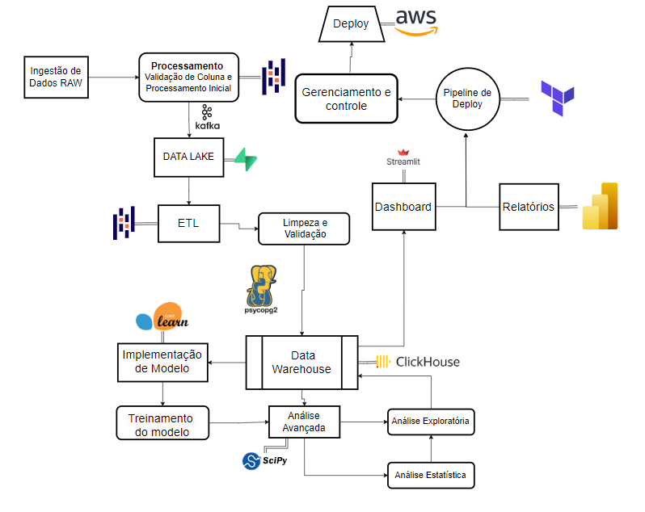
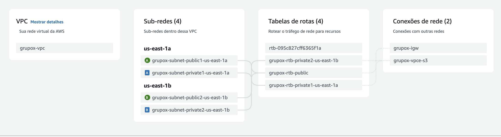
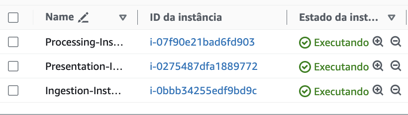

# Tenplate da arquitetura

# Sumário

- [User Stories e Requisitos da Aplicação](#user-stories-e-requisitos-da-aplicação)
- [Arquitetura do DataApp](#arquitetura-do-dataapp)
- [Ferramentas e Tecnologias Utilizadas](#ferramentas-e-tecnologias-utilizadas)
- [Framework de Testes](#framework-de-testes)
- [Estratégia de Testes](#estratégia-de-testes)
- [Descrição Detalhada dos Testes](#descrição-detalhada-dos-testes)

# User Stories e Requisitos da Aplicação 

| **User Stories**                                                                                       | **Requisitos Funcionais**                                                                                                                                              | **Requisitos não funcionais**                                                                                                   |
| ------------------------------------------------------------------------------------------------------- | --------------------------------------------------------------------------------------------------------------------------------------------------------------------- | ------------------------------------------------------------------------------------------------------------------------------- |
| Como gerente de loja, quero visualizar as projeções de vendas e remuneração da minha equipe.            | A ferramenta deve permitir que gerentes visualizem projeções de vendas e remuneração, com filtros por período.                                                        | Criptografia adequada para proteger dados pessoais e de desempenho.                                                             |
| Como vendedor, quero acessar informações personalizadas sobre minhas vendas e remuneração.              |                                                                                                                                                                       | Desempenho e Escalabilidade: Processamento em tempo real de grandes volumes de dados.                                           |
| Como gerente de loja, quero receber recomendações de produtos para maximizar o cross-sell.              | A ferramenta deve fornecer recomendações personalizadas de produtos frequentemente vendidos juntos.                                                                   |                                                                                                                                 |
| Como vendedor, quero saber quais produtos têm a maior margem de lucro.                                  | A ferramenta deve exibir produtos com as maiores margens de lucro, personalizadas para cada vendedor.                                                                  |                                                                                                                                 |
| Como gerente de loja, quero comparar o desempenho da minha loja com outras lojas.                       | A ferramenta deve permitir que os gerentes comparem o desempenho de sua loja com outras, oferecendo destaques nas áreas de melhoria.                                  |                                                                                                                                 |
| Como gerente de loja, quero que a ferramenta seja fácil de usar e acessível em dispositivos.            | A ferramenta deve ser acessível via dispositivos móveis, com uma interface intuitiva e responsiva, compatível com diferentes sistemas operacionais.                    | Disponibilidade: A ferramenta deve estar disponível 24/7 com redundância de servidores.                                         |
| Como gerente de loja, quero receber alertas automáticos sobre produtos com baixa performance.           | A ferramenta deve enviar notificações automáticas aos gerentes sobre produtos com desempenho de vendas abaixo da média, com sugestões de ações corretivas.            | Usabilidade: A interface deve ser fácil de navegar e incluir tutoriais ou ajuda integrada.                                      |
| Como vendedor, quero acessar um histórico das minhas vendas e desempenho ao longo do tempo.             | A ferramenta deve permitir que vendedores acessem um histórico detalhado de suas vendas e desempenho, visualizando dados por diferentes períodos.                     | Compatibilidade: A ferramenta deve ser compatível com diferentes navegadores e dispositivos, garantindo uma experiência de usuário consistente em todas as plataformas. |
| Como gerente de loja, quero personalizar os relatórios de desempenho que compartilho com a equipe.      | Gerentes devem poder personalizar relatórios de desempenho, selecionando métricas específicas e criando visões customizadas para compartilhar com a equipe.           | Tempo de Resposta dos Alertas: Os alertas automáticos devem ser enviados em tempo real, com um tempo de resposta de no máximo 1 minuto.                               |
| Como vendedor, quero receber sugestões de produtos para promover com base nas tendências atuais.        | A ferramenta deve fornecer sugestões de produtos para os vendedores promoverem, baseadas em dados de vendas atuais e tendências de mercado.                           | Retenção de Dados: A ferramenta deve manter um histórico de dados de vendas e desempenho por um período mínimo.                |
| Como gerente de loja, quero ter acesso a um dashboard com as principais métricas de desempenho.         | Dashboard de Desempenho Consolidado: A ferramenta deve oferecer um dashboard onde os gerentes possam visualizar todas as principais métricas de desempenho da loja, de forma consolidada e fácil de interpretar. | Configuração de Alertas e Relatórios: A ferramenta deve permitir que gerentes configurem alertas e personalizem relatórios sem necessidade de suporte técnico.        |
|                                                                                                         |                                                                                                                                                                       | Atualização Frequente de Sugestões e Dashboards: Sugestões de produtos e dashboards devem ser atualizados diariamente para refletir mudanças nas tendências de vendas. |
|                                                                                                         |                                                                                                                                                                       | Escalabilidade Horizontal: A ferramenta deve suportar a adição de novas lojas e usuários sem comprometer o desempenho.          |

# Arquitetura do DataApp

### Arquitetura do DataApp: Fluxo de Dados, Processamento, Armazenamento, Segurança, Análise e Visualização

Esta arquitetura descreve o fluxo de dados, processamento, armazenamento, segurança, análise e visualização no DataApp, desenvolvido para otimizar a análise de dados e a tomada de decisões em uma organização.

## 1. Ingestão de Dados

### **Ingestão de Dados RAW**
A primeira etapa do processo é a **Ingestão de Dados RAW**, onde os dados brutos são coletados de várias fontes e inseridos no sistema para processamento posterior. Esses dados podem incluir transações, logs, e outras formas de dados não estruturados que serão processados em etapas subsequentes.

## 2. Processamento de Dados

### **Validação de Colunas e Processamento Inicial**
Após a ingestão, os dados passam por uma **Validação de Colunas e Processamento Inicial**. Utilizando a linguagem **R**, esta fase garante que os dados estejam estruturados corretamente, identificando e corrigindo problemas antes de prosseguir. Este processamento inicial também pode incluir a normalização de dados e a remoção de duplicatas.

### **Envio para o Data Lake via Kafka**
Uma vez processados, os dados são enviados para o **Data Lake**. O **Apache Kafka** é utilizado para gerenciar o fluxo de dados, proporcionando alta disponibilidade e consistência durante a transmissão. O Data Lake atua como um repositório centralizado para armazenar dados em seu estado bruto, permitindo fácil acesso para análises e transformações subsequentes.

### **ETL (Extract, Transform, Load)**
Dentro do Data Lake, os dados brutos são submetidos a um processo de **ETL (Extract, Transform, Load)**. Utilizando o **Apache Spark**, os dados são extraídos, transformados e carregados no **Data Warehouse**. Durante essa fase, as ferramentas de ETL garantem que os dados sejam limpos, estruturados, e otimizados para consultas analíticas. O **Apache Nifi** é integrado para facilitar o gerenciamento e automação dos fluxos de dados entre diferentes sistemas.

## 3. Armazenamento de Dados

### **Limpeza e Validação Adicional**
Antes de serem armazenados definitivamente no Data Warehouse, os dados passam por uma **Limpeza e Validação Adicional**. Esta etapa assegura que os dados estão prontos para análises avançadas e uso em produção. As regras de qualidade são aplicadas rigorosamente para garantir a integridade e a confiabilidade dos dados armazenados.

### **Encriptação dos Dados**
Para garantir a segurança, os dados passam por um processo de **Encriptação** antes de serem armazenados no **Data Warehouse**. Isso protege os dados em repouso, cumprindo com regulamentações de proteção de dados e prevenindo acessos não autorizados.

### **Armazenamento no Data Warehouse (ClickHouse)**
Os dados validados e encriptados são então armazenados no **Data Warehouse** utilizando o **ClickHouse**. Este banco de dados colunar é altamente eficiente para processamento de grandes volumes de dados, oferecendo suporte rápido e escalável para análises complexas e consultas em tempo real.

## 4. Análise e Modelagem

### **Desencriptação e Análise Avançada**
Os dados armazenados no Data Warehouse são desencriptados conforme necessário para **Análise Avançada**. **SciPy** é empregado para realizar análises estatísticas e execuções de algoritmos matemáticos avançados, permitindo a geração de insights detalhados e previsões precisas.

### **Treinamento de Modelos**
Os dados disponíveis também são utilizados para **Treinamento de Modelos Preditivos**. Com o uso de **Scikit-learn**, modelos preditivos são desenvolvidos e implementados para antecipar tendências e apoiar a tomada de decisões estratégicas.

## 5. Visualização e Relatórios

### **Dashboards Interativos (Streamlit)**
Os resultados das análises são apresentados através de **Dashboards Interativos** criados com **Streamlit**. Esta ferramenta permite a criação de interfaces dinâmicas que facilitam a exploração dos dados e a visualização dos resultados em tempo real, sendo essencial para monitoramento contínuo e avaliações rápidas.

### **Relatórios Detalhados (Power BI)**
Além dos dashboards, relatórios detalhados são gerados utilizando **Power BI**. Esses relatórios consolidam as informações e as apresentam de maneira compreensível para os usuários finais, oferecendo insights acionáveis e facilitando a comunicação entre diferentes níveis da organização.

## 6. Deploy e Infraestrutura

### **Pipeline de Deploy Automatizado**
A infraestrutura para o DataApp é gerenciada através de um **Pipeline de Deploy** automatizado, construído com **Terraform**. Este pipeline lida com a criação e o gerenciamento de recursos na **AWS**, garantindo consistência e permitindo que as atualizações sejam facilmente implementadas.

### **Gerenciamento e Controle Contínuos**
O deploy das aplicações, incluindo os dashboards e relatórios, é realizado na **AWS**. O **Gerenciamento e Controle Contínuos** do ambiente asseguram que o sistema funcione conforme o esperado, com monitoramento, manutenção e atualizações regulares. Isso inclui a utilização de containers Docker para garantir que as aplicações sejam portáveis e possam ser executadas em qualquer ambiente com consistência.

### **Autenticação e Controle de Acesso**
O acesso ao sistema é protegido por **Autenticação** robusta, garantindo que somente usuários autorizados possam acessar dados sensíveis e realizar operações críticas. As políticas de controle de acesso são aplicadas para garantir que os dados e processos estejam protegidos contra acessos não autorizados.

## Conclusão

Esta arquitetura foi desenhada para ser robusta, modular e escalável, proporcionando um fluxo eficiente de dados desde a ingestão até a análise e visualização. O uso das tecnologias como **Kafka**, **Spark**, **ClickHouse**, e **Terraform** oferece um ambiente otimizado para análises avançadas, garantindo segurança e performance em todas as etapas do processo. A abordagem centrada em dashboards interativos e relatórios detalhados facilita a tomada de decisões informadas, aumentando a eficácia e agilidade da organização.

### Ferramentas e Tecnologias utilizadas na arquitetura 
| Ferramenta | Descrição |
|---|---|
| ClickHouse | Escolhemos o ClickHouse por sua excelência em consultas analíticas sobre grandes volumes de dados. Sua arquitetura orientada a colunas o torna ideal para processar rapidamente logs e dados históricos. Utilizamos o ClickHouse para realizar análises em tempo real e quase real, como a identificação de padrões em dados de sensores. |
| Apache Kafka | Adotamos o Kafka como nosso sistema de streaming, pois ele nos permite processar fluxos contínuos de dados de forma escalável e robusta. Utilizamos o Kafka para ingerir dados de diversas fontes, como sistemas de IoT e aplicações web, e distribuí-los para diferentes componentes do nosso pipeline de dados. |
| Apache Kafka (Data Lake) | Utilizamos o Kafka como um hub central de dados, onde os fluxos contínuos são armazenados de forma durável. Isso nos permite consumir esses dados posteriormente para diversas análises, construindo um data lake robusto e escalável. |
| ClickHouse (Armazenamento) | Além do processamento, utilizamos o ClickHouse como nosso armazenamento principal para dados analíticos. Sua estrutura orientada a colunas e alta performance em consultas nos permitem realizar análises exploratórias e responder a perguntas de negócio de forma rápida e eficiente. |
| SciPy e Scikit-learn | Essas bibliotecas Python são fundamentais para nossas análises estatísticas e de machine learning. Utilizamos o SciPy para realizar cálculos numéricos e o Scikit-learn para construir modelos preditivos e de classificação. |
| Streamlit | Para compartilhar os insights obtidos com as nossas análises, utilizamos o Streamlit para criar dashboards interativos e intuitivos. Com o Streamlit, nossos stakeholders podem explorar os dados de forma visual e interagir com os resultados das nossas análises. |
| Power BI | Complementamos nosso ecossistema com o Power BI para criar relatórios personalizados e dashboards interativos para a alta gestão. O Power BI nos permite visualizar os dados de forma clara e concisa, facilitando a tomada de decisão. |

Em resumo, essa combinação de ferramentas nos permite coletar, processar, analisar e visualizar grandes volumes de dados de forma eficiente e eficaz. A escolha dessas tecnologias foi baseada nas nossas necessidades específicas, como a necessidade de alto processamento, a capacidade de lidar com grandes volumes de dados e a facilidade de uso. Ao trabalharmos em conjunto, essas ferramentas nos proporcionam uma plataforma robusta para impulsionar a tomada de decisão baseada em dados.

## Framework de testes 

### **Visão Geral**
O framework de testes escolhido para este projeto é o pytest. O pytest é uma ferramenta poderosa e popular no ecossistema Python, utilizada para realizar testes automatizados. Ele suporta desde testes unitários até testes de integração e sistema, sendo flexível o suficiente para atender a diferentes necessidades de teste.

### **Por que Escolhemos pytest?**
Optamos pelo pytest por diversas razões:
- **Simplicidade e Eficiência**: A sintaxe simples do pytest permite escrever testes de maneira rápida e intuitiva. Ele usa convenções claras para nomear arquivos e funções de teste, facilitando a organização.
- **Fixtures Poderosas**: O pytest permite criar fixtures que são funções reutilizáveis que configuram o estado necessário para testes. Elas são especialmente úteis para preparar dados ou ambientes antes que os testes sejam executados.
- **Ampla Adotação e Comunidade**: Sendo amplamente adotado, o pytest possui uma comunidade ativa e uma vasta quantidade de plugins que estendem sua funcionalidade. Isso garante que você possa contar com suporte e soluções para diferentes necessidades de teste.
- **Relatórios Detalhados**: O pytest gera relatórios de execução de testes detalhados, com informações completas sobre falhas, exceções, e a quantidade de testes passados e falhados.

### **Benefícios do Uso de Testes Automatizados**
- **Detecção Precoce de Erros**: Testes automatizados permitem identificar problemas e bugs logo nas fases iniciais de desenvolvimento, evitando que erros se propaguem para o ambiente de produção.
- **Manutenção e Evolução**: Com um conjunto robusto de testes, podemos fazer alterações no código com mais segurança, sabendo que qualquer regressão será detectada pelos testes.
- **Documentação Viva**: Os testes servem como uma forma de documentação viva do sistema, mostrando como as diferentes partes do código são esperadas a funcionar.

## Estratégia de Testes

### **Testes Unitários**
Os testes implementados são, majoritariamente, testes unitários. Testes unitários têm como objetivo isolar e verificar o comportamento de pequenas partes do código, como funções ou métodos, garantindo que cada parte funcione corretamente de forma independente das outras.

### **Cobertura de Testes**
A cobertura dos testes é abrangente, com foco em garantir que todas as funções críticas do sistema sejam testadas sob diversas condições. Isso inclui cenários de sucesso, falha, e situações-limite.

### **Ferramentas e Metodologias**
- **pytest**: Principal ferramenta utilizada para execução dos testes.
- **Mocking**: Técnicas de mocking foram aplicadas em diversas partes dos testes para isolar as funções testadas de suas dependências externas, como conexões a bancos de dados ou APIs externas.

## Descrição Detalhada dos Testes

### **1 test_clean_data.py**
**Propósito**: Este teste verifica a função responsável por limpar os dados brutos antes de serem processados. 
- **Funcionalidades Testadas**: Remoção de valores nulos, normalização de formatos (como datas e números), e correção de inconsistências nos dados.
- **Cenários Testados**:
  - Dados com valores nulos em diferentes colunas.
  - Formatos de data inconsistentes.
  - Dados duplicados ou incorretos.
  
### **2 test_connect_to_clickhouse.py**
**Propósito**: Garantir que a função que conecta ao banco de dados ClickHouse funcione corretamente.
- **Funcionalidades Testadas**: Estabelecimento da conexão, manuseio de credenciais, e tratamento de erros.
- **Cenários Testados**:
  - Conexão bem-sucedida ao banco de dados.
  - Falhas na conexão devido a credenciais incorretas.
  - Tratamento de erros de conexão.

### **3 test_connect_to_supabase.py**
**Propósito**: Testar a função de conexão com o banco de dados Supabase.
- **Funcionalidades Testadas**: Leitura e escrita de dados no Supabase, verificação de credenciais e manejo de erros.
- **Cenários Testados**:
  - Conexão bem-sucedida ao Supabase.
  - Tentativa de conexão com credenciais inválidas.
  - Verificação da resposta do banco em casos de erro.

### **4 test_extract_data.py**
**Propósito**: Verificar se a extração de dados de diferentes fontes está funcionando conforme o esperado.
- **Funcionalidades Testadas**: Capacidade de extrair dados em diferentes formatos (CSV, JSON, etc.) e de diferentes locais (local, nuvem).
- **Cenários Testados**:
  - Extração de dados em formato CSV.
  - Extração de dados em formato JSON.
  - Verificação de erros ao acessar fontes de dados indisponíveis.

### **5 test_list_supabase_tables.py**
**Propósito**: Este teste verifica se a função que lista as tabelas disponíveis no Supabase funciona corretamente.
- **Funcionalidades Testadas**: Recuperação da lista de tabelas e verificação de sua existência.
- **Cenários Testados**:
  - Tabelas presentes no Supabase.
  - Tentativa de listar tabelas em um banco vazio.
  - Verificação de permissões de acesso às tabelas.

### **6 test_load_data_to_clickhouse.py**
**Propósito**: Testar o carregamento de dados no banco de dados ClickHouse.
- **Funcionalidades Testadas**: Transferência de dados do sistema para o ClickHouse, garantindo a integridade dos dados após o carregamento.
- **Cenários Testados**:
  - Carregamento bem-sucedido de dados.
  - Verificação de integridade após o carregamento.
  - Tratamento de erros durante o processo de carga.

### **7 test_load_data.py**
**Propósito**: Verificar a função responsável por carregar dados de diversas fontes no sistema.
- **Funcionalidades Testadas**: Manipulação e armazenamento correto dos dados recebidos.
- **Cenários Testados**:
  - Carregamento de grandes volumes de dados.
  - Verificação de desempenho.
  - Tratamento de arquivos corrompidos ou incompletos.

### **8 test_normalize_data.py**
**Propósito**: Testar a normalização dos dados para garantir que todos os dados estejam formatados corretamente.
- **Funcionalidades Testadas**: Formatação de datas, padronização de texto, e normalização de números.
- **Cenários Testados**:
  - Normalização de datas em diferentes formatos.
  - Conversão de texto para um padrão específico (maiúsculas/minúsculas).
  - Arredondamento e formatação de números.

### **9 test_process_data.py**
**Propósito**: Verificar o processamento dos dados, incluindo transformações, agregações e outras operações definidas no pipeline.
- **Funcionalidades Testadas**: Transformação de dados, agregação de valores e cálculo de métricas.
- **Cenários Testados**:
  - Processamento de grandes conjuntos de dados.
  - Aplicação de regras de negócios complexas.
  - Verificação de resultados após a transformação.

### **10 test_send_to_kafka.py**
**Propósito**: Testar a funcionalidade de envio de dados para o Kafka.
- **Funcionalidades Testadas**: Publicação de mensagens no tópico correto, verificação de entrega, e tratamento de falhas.
- **Cenários Testados**:
  - Envio bem-sucedido de mensagens para o Kafka.
  - Verificação de mensagens não entregues.
  - Manejo de falhas de rede durante o envio.

### **11 test_store_in_supabase.py**
**Propósito**: Verificar o armazenamento de dados no Supabase.
- **Funcionalidades Testadas**: Armazenamento e recuperação de dados, verificação da consistência dos dados armazenados.
- **Cenários Testados**:
  - Armazenamento de dados complexos (JSON).
  - Recuperação e validação dos dados armazenados.
  - Manejo de falhas durante o processo de armazenamento.

### **12 test_transform_data.py**
**Propósito**: Testar a transformação dos dados, assegurando que sejam convertidos corretamente de um formato para outro conforme as regras definidas.
- **Funcionalidades Testadas**: Conversão de formatos de dados, aplicação de regras de negócios e formatação final.
- **Cenários Testados**:
 s - Transformação de dados simples (numérico para string).
  - Aplicação de múltiplas transformações em sequência.
  - Verificação de dados após múltiplas transformações.

# Pipeline de cloud 

Este pipeline de cloud foi desenvolvido com três camadas essenciais para suportar o fluxo completo de dados: **Ingestão**, **Processamento** e **Apresentaçao**. Cada uma dessas camadas tem sua própria função e é executada em instâncias EC2 configuradas individualmente, dentro de uma **VPC (Virtual Private Cloud)** da AWS, garantindo um ambiente isolado e seguro para as operações.

## Uso do Terraform

Aqui no pipeline, usamos o **Terraform** para automatizar a criação das instâncias EC2, sub-redes e todo o ambiente de rede da AWS. Ele nos ajuda a garantir que a infraestrutura seja configurada exatamente do jeito que precisamos, sem precisar entrar manualmente no console da AWS. Basicamente, escrevemos o código uma vez, e ele cuida de levantar tudo de forma rápida, desde a VPC até as permissões de segurança.

### Detalhes da Configuraçao:
- **Provedor de Cloud:** AWS
- **Região:** us-east-1

## Configuraçao da VPC

Uma **Virtual Private Cloud (VPC)** foi criada para fornecer um espaço de rede isolado, onde podemos controlar o acesso e a comunicaçao entre os diversos componentes da infraestrutura de maneira centralizada.

- **Bloco CIDR:** 10.0.0.0/16
- **Nome:** grupox-vpc

### Componentes da Rede:

1. **Sub-redes (Subnets):**
   - **Sub-redes Públicas:** Responsáveis por conectar as instâncias que precisam de acesso à internet.
     - `grupox-subnet-public1-us-east-1a`: Sub-rede pública na zona de disponibilidade 1a.
     - `grupox-subnet-public2-us-east-1b`: Sub-rede pública na zona de disponibilidade 1b.
   - **Sub-redes Privadas:** Usadas para comunicaçao interna entre os componentes que nao precisam de acesso à internet diretamente.
     - `grupox-subnet-private1-us-east-1a`: Sub-rede privada na zona de disponibilidade 1a.
     - `grupox-subnet-private2-us-east-1b`: Sub-rede privada na zona de disponibilidade 1b.

2. **Gateway de Internet:**
   O gateway de internet (`grupox-igw`) permite que as instâncias nas sub-redes públicas se conectem à internet. Isso é essencial para as instâncias que precisam realizar operaçoes externas, como baixar atualizaçoes ou enviar dados para serviços fora da VPC.

3. **Tabelas de Rotas:**
   As tabelas de rotas controlam para onde o tráfego de rede é direcionado. Neste caso, temos:
   - **Tabela de Rota Pública:** (`grupox-rtb-public`): Responsável por rotear o tráfego da sub-rede pública para o gateway de internet.
   - **Tabelas de Rota Privada:** Usadas para trafegar dados entre as sub-redes privadas, onde o tráfego nao precisa sair para a internet.

4. **Grupo de Segurança (Security Group):**
   O grupo de segurança (`my_sg`) é configurado para definir quais portas estao abertas para tráfego nas instâncias EC2. Este controle de tráfego é fundamental para garantir a segurança da infraestrutura. As regras incluem:
   - **Porta 22 (SSH):** Permite que administradores acessem as instâncias remotamente via SSH.
   - **Porta 80 (HTTP):** Permite tráfego HTTP para aplicaçoes web.

## Camadas do Pipeline

### 1. Camada de Ingestão

A primeira camada, chamada **Ingestao**, tem como objetivo coletar dados brutos de diversas fontes externas. Esses dados sao posteriormente encaminhados para a camada de processamento. A instância EC2 responsável por esta camada foi configurada com maior capacidade para suportar a ingestão de grandes volumes de dados.

- **AMI:** ami-0ebfd941bbafe70c6 (Amazon Linux 2)
- **Tipo de Instância:** `t3.xlarge`
- **Nome da Instância:** Ingestion-Instance
- **Sub-rede:** Sub-rede pública (us-east-1a)
- **Provisionamento:**
  - Transferência de arquivos de dados para a instância.
  - Execução de um script de ingestao em Python (`ingestion.py`) que utiliza `boto3` e `kafka-python` para interagir com o S3 e Kafka, garantindo a captura eficiente dos dados.

### 2. Camada de Processamento

Após a ingestão dos dados brutos, a segunda camada, chamada **Processamento**, entra em ação. Nessa fase, os dados sao filtrados, agregados e transformados de acordo com as necessidades do projeto. O processamento é realizado em uma instância EC2 otimizada para lidar com tarefas computacionais mais intensas.

- **AMI:** ami-0ebfd941bbafe70c6 (Amazon Linux 2)
- **Tipo de Instância:** `t3.xlarge`
- **Nome da Instância:** Processing-Instance
- **Sub-rede:** Sub-rede pública (us-east-1a)
- **Provisionamento:**
  - Transferência dos arquivos necessários para a instância EC2.
  - Execução do script de processamento em Python (`processing.py`), que aplica as transformaçoes e otimizaçoes nos dados.

### 3. Camada de Apresentação

A terceira e última camada é a **Camada de Apresentaçao**, que se encarrega de mostrar os dados processados de forma visual e interativa. Nessa etapa, os dados transformados sao exibidos através de um dashboard web, permitindo análises detalhadas.

- **AMI:** ami-0ebfd941bbafe70c6 (Amazon Linux 2)
- **Tipo de Instância:** `t3.xlarge`
- **Nome da Instância:** Presentation-Instance
- **Sub-rede:** Sub-rede pública (us-east-1a)
- **Provisionamento:**
  - Instalação de ferramentas como o **Streamlit** para criar o dashboard de apresentaçao de dados.
  - Execução do Streamlit para renderizar o dashboard com os dados processados, permitindo aos usuários finais acessarem uma interface gráfica intuitiva.

## Arquitetura de Comunicação

### Comunicaçao Entre as Instâncias

A comunicaçao entre as instâncias ocorre internamente na VPC. As sub-redes privadas garantem que a comunicaçao entre as camadas de ingestão, processamento e apresentaçao seja feita de forma segura e isolada da internet. 

- **Sub-redes públicas:** Sao usadas para permitir que as instâncias acessem serviços externos (como o download de pacotes de software).
- **Sub-redes privadas:** Permitem a troca de dados sensíveis e o processamento interno sem exposiçao à internet.

### Segurança

O grupo de segurança foi configurado para restringir o acesso às portas essenciais (como SSH e HTTP) e permitir que o tráfego seja direcionado corretamente entre as instâncias e a internet. Além disso, o tráfego de saída (egress) é liberado para permitir que as instâncias se conectem a serviços externos, quando necessário.

## Conclusão

Este pipeline foi projetado para ser escalável e modular, com cada camada tendo sua própria instância EC2 dedicada. A flexibilidade das três camadas (Ingestao, Processamento e Apresentaçao) permite que elas sejam otimizadas e escaladas de maneira independente, dependendo das necessidades da aplicaçao.

A arquitetura garante alta disponibilidade, segurança e eficiência na captura, transformaçao e apresentaçao dos dados.

